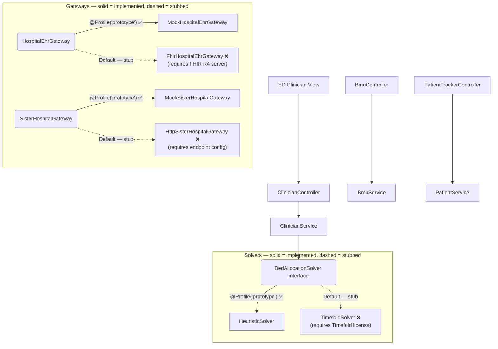

# Architecture Deep Dive

## Overview

The project is built as a Spring Boot 4.1 + React 19 (TypeScript) monorepo. I designed the architecture to be **production-architected by design** — interfaces, domain logic, and profile boundaries are structured so that swapping in real adapters is additive integration work, not an architectural rewrite. All prototype simplifications are strictly isolated under `@Profile("prototype")`. Default beans (active when no profile is set) define the production integration contracts but are currently stubbed — they exist to enforce the interface boundary and fail-fast if run without the required infrastructure.

## System Architecture Diagram

## Architectural Dimensions: Prototype vs Production

I structured the system to allow for rapid prototyping while maintaining a clear path to production deployment. Here is a comparison of the prototype implementation versus the production target across ten key architectural dimensions.

| Dimension | Prototype Approach `[IMPLEMENTED]` | Production Target `[DESIGNED — NOT YET IMPLEMENTED]` | Design Rationale | Relevant Ticket |
| ----------- | ------------------- | ------------------- | ------------------ | ----------------- |
| **1. Real-Time Communication** | REST + TanStack Query polling (2-3s). | Event Sourcing, CQRS, WebSocket/STOMP. | I chose polling for the prototype to avoid WebSocket complexity in local environments, while decoupling state management in the UI. | [Ticket 003](../.wayfinder/tickets/003-realtime-event-notification-mechanism.md) |
| **2. Hospital EHR Integration** | `MockHospitalEhrGateway` with synthetic P101-P104 data. | `FhirHospitalEhrGateway` (HAPI FHIR R4, mTLS, SMART on FHIR). | Isolating EHR interactions behind a gateway interface allows the prototype to function without external VPN access or complex data generation. | [Ticket 008](../.wayfinder/tickets/008-live-hospital-ehr-fhir-ingestion-pipeline.md) |
| **3. Sister Hospital & Diversion Gateway** | `MockSisterHospitalGateway` with simulated acceptance logic. | `HttpSisterHospitalGateway` (Resilience4j circuit breakers, mTLS). | Allows end-to-end testing of cross-hospital diversions without requiring a live external B2B integration environment. | [Ticket 007](../.wayfinder/tickets/007-sister-hospital-gateway-and-prototype-profile.md) |
| **4. Authentication & RBAC** | `PrototypeSecurityFilter` with header-driven persona switching (`X-User-Role`/`X-User-Id`). | Spring Security OAuth2/JWT + Singpass OIDC. | Persona switching via headers drastically speeds up UI/UX testing across different clinician roles without repetitive login flows. | [Ticket 009](../.wayfinder/tickets/009-enterprise-security-rbac-and-im8-audit.md) |
| **5. Audit Logging & IM8 Compliance** | Structured SLF4J/MDC to stdout, parsed via `grep`/`jq`/`awk`. | Enterprise SIEM (CloudWatch, Splunk) with WORM storage. | Emitting structured JSON to stdout fulfills the immediate need for audit traceability while remaining portable and easy to query locally. | [Ticket 009](../.wayfinder/tickets/009-enterprise-security-rbac-and-im8-audit.md) |
| **6. Constraint Optimization Engine** | `HeuristicBedAllocationSolver` (pure Java, synchronous, <50ms). | `TimefoldBedAllocationSolver` (continuous daemon, multi-hospital clusters). | The heuristic solver provides instant feedback for the prototype's UI, whereas Timefold will handle complex, large-scale optimisations asynchronously in production. | [Ticket 010](../.wayfinder/tickets/010-advanced-constraint-solver-migration.md) |
| **7. Persistence** | H2 in-memory with create-drop + `DataInitializer` seed. | Clustered PostgreSQL with Flyway migrations. | In-memory DB ensures a clean slate on every start, preventing state pollution across prototype testing sessions. | [Ticket 001](../.wayfinder/tickets/001-data-model-and-domain-entities.md) |
| **8. KPI Observability** | Dual-pathway verified locally (SQL + CLI bash scripts). | Read replicas + SIEM dashboards + real-time alerting. | Ensures that core metrics are accurately tracked without the overhead of maintaining a full observability stack in the prototype. | [Ticket 011](../.wayfinder/tickets/011-kpi-logging-and-metric-extraction-architecture.md) |
| **9. Patient Engagement** | Token-based REST with 5-min periodic updates + simulation endpoint. | SMS/WhatsApp via hospital notification gateways, 2-hour intervals. | Avoids real SMS costs and delays during prototyping, enabling rapid testing of patient notifications. | [Ticket 006](../.wayfinder/tickets/006-tracer-bullet-2-patient-tracker-and-turnover-loop.md) |
| **10. Bed Turnover Lifecycle** | Ward console 1-click actions emulating physical workflows. | IoT bed sensors, BCMA, EVS mobile dispatch apps. | Abstracts away the physical hardware and external operational dependencies needed for real bed turnover management. | [Ticket 006](../.wayfinder/tickets/006-tracer-bullet-2-patient-tracker-and-turnover-loop.md) |

## Key Architectural Patterns

To achieve these design goals, I employed several key architectural patterns:

- **Gateway / Adapter Pattern (Hexagonal Architecture)** `[INTERFACES IMPLEMENTED, PRODUCTION ADAPTERS STUBBED]`: Isolates core business logic from external systems (EHR, sister hospitals). Prototype mocks are fully functional; production adapters are defined as interface contracts (stubbed) pending real integration endpoints.
- **Spring Profile Boundary Pattern** `[IMPLEMENTED]`: All prototype functionality is explicitly isolated using `@Profile("prototype")`.
- **Pluggable Strategy Pattern** `[IMPLEMENTED]`: The `BedAllocationSolver` interface allows swapping between heuristic (implemented, prototype) and Timefold (stubbed, production target) implementations.
- **Gated State Machine** `[IMPLEMENTED]`: Distinguishes between Consult-Gated and Direct Admission flows.
- **Consensus Completion Gate Pattern** `[IMPLEMENTED]`: Manages multi-department agreement before state transitions.
- **Safety-First Discordance Engine** `[IMPLEMENTED]`: Ensures patient safety by applying highest acuity and telemetry union rules during conflict resolution.
- **Two-Tier Constraint Hierarchy** `[IMPLEMENTED]`: Separates Absolute Safety Invariants (hard constraints) from Overridable Operational Constraints (soft constraints).
- **Dual-Pathway Metric Extraction** `[IMPLEMENTED]`: Extracts metrics reliably via SQL or Structured Logs.
- **Auditable Entity Pattern with MDC** `[IMPLEMENTED]`: Ensures all state changes are contextually logged for compliance.

## Architecture Decision Records

I have documented the pivotal design choices in the following Architecture Decision Records (ADRs):

- [ADR-0007: Consult-Gated Bed Allocation](adr/0007-consult-gated-bed-allocation.md): Details the separation of consult-gated flows from direct admissions.
- [ADR-0008: Multi-Broadcast Consult Chaining](adr/0008-multi-broadcast-consult-chaining.md): Outlines the mechanism for handling serial and parallel intra-hospital consults.
- [ADR-0009: BMU Admitting Service Placement](adr/0009-bmu-admitting-service-placement.md): Explains the integration of Bed Management Unit workflows in the admitting lifecycle.
- [ADR-0010: Two-Tier Bed Allocation Constraints](adr/0010-two-tier-bed-allocation-constraints.md): Defines the separation of hard safety rules from soft operational guidelines.
