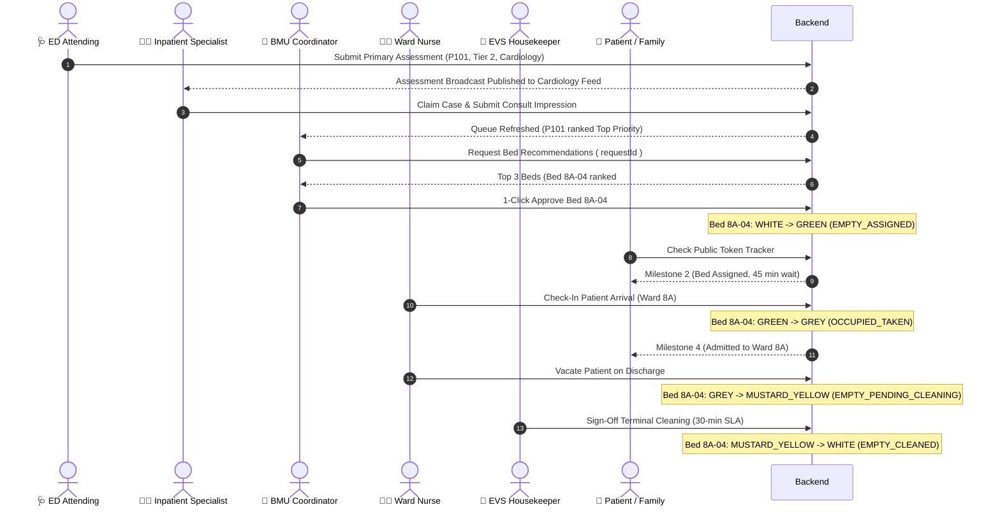
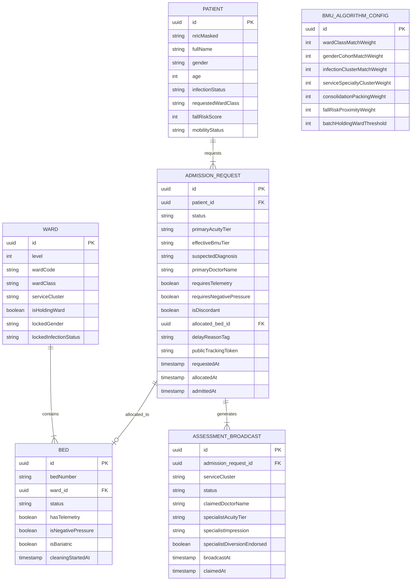
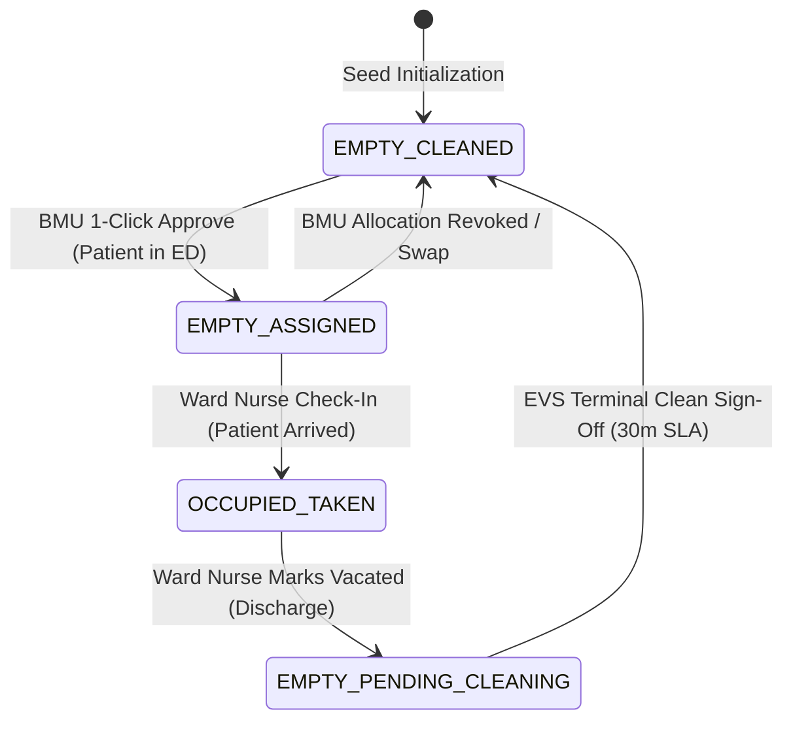
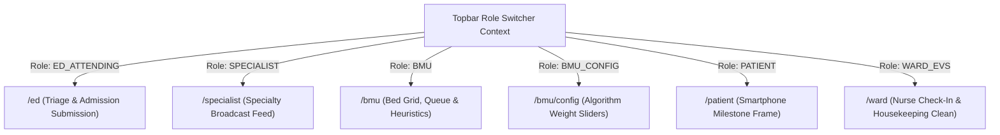
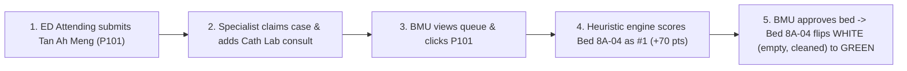
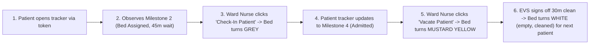

# Technical Architecture Document (TAD) & Implementation Specification

## Intelligent Patient Flow & Bed Capacity Orchestration System

- **Version**: `1.0.0-PROTOTYPE`
- **Status**: `APPROVED FOR IMPLEMENTATION`
- **Target Stack**: Spring Boot 3 (Java 17/21) + React 18 (TypeScript, Vite, Tailwind CSS, TanStack Router & Query)
- **Source Artifacts**: [`product-idea/pain-points.md`](file:///Users/tjunrong/Documents/playground/enhance-hospital-admissions/product-idea/pain-points.md), [`product-idea/user-stories.md`](file:///Users/tjunrong/Documents/playground/enhance-hospital-admissions/product-idea/user-stories.md), [`.wayfinder/map.md`](file:///Users/tjunrong/Documents/playground/enhance-hospital-admissions/.wayfinder/map.md)

---

## Table of Contents

1. [Executive Summary & System Vision](#1-executive-summary--system-vision)
2. [Architectural Philosophy: Prototype vs. Target Production Architecture](#2-architectural-philosophy-prototype-vs-target-production-architecture)
3. [System Architecture & Monorepo Topology](#3-system-architecture--monorepo-topology)
4. [Domain Model & Entity Relational Design (ADR-001)](#4-domain-model--entity-relational-design-adr-001)
5. [Bed State Machine & Heuristic Engine (ADR-002)](#5-bed-state-machine--heuristic-engine-adr-002)
6. [Real-Time & State Notification Architecture (ADR-003)](#6-real-time--state-notification-architecture-adr-003)
7. [API Surface & REST Contracts (ADR-004)](#7-api-surface--rest-contracts-adr-004)
8. [Frontend Architecture & UI Role Matrix (ADR-005, ADR-006)](#8-frontend-architecture--ui-role-matrix-adr-005-adr-006)
9. [End-to-End Tracer Bullet Delivery Plan](#9-end-to-end-tracer-bullet-delivery-plan)
10. [Traceability Matrix (User Stories to Architecture)](#10-traceability-matrix-user-stories-to-architecture)

---

## 1. Executive Summary & System Vision

Hospital emergency department (ED) overcrowding and prolonged admission boarding times represent critical systemic healthcare challenges. Current workflows suffer from fragmented phone/EHR handoffs, clinical discordance between ED physicians and inpatient specialists, manual spreadsheet-based bed allocation by Bed Management Units (BMU), poor visibility for anxious patients and families, and delayed post-discharge room turnover.

The **Intelligent Patient Flow & Bed Capacity Orchestration System** resolves these bottlenecks by providing:

1. **Clinical Assessment & Broadcast Hub**: Primary ED intake with 1-click clinical submission, paired with a parallel broadcast feed for on-call inpatient specialists to eliminate phone tag and surface discordant acuity evaluations.
2. **Heuristic Bed Allocation & Dynamic Batching Engine**: Real-time bed recommendation balancing clinical constraints (ward class, infection control, gender cohorts, telemetry) with operational efficiency (consolidation packing, dynamic holding ward batching, and cohort-swap reallocations).
3. **Public Patient Milestone Tracker**: Token-based mobile tracker providing queue transparency, milestone progression, estimated wait times, and proactive care/financial guidance.
4. **Closed-Loop Discharge Turnover**: Inpatient nurse vacate triggers and housekeeping 30-minute terminal cleaning SLA sign-offs that flip beds back to available states immediately.

---

## 2. Architectural Philosophy: Prototype vs. Target Production Architecture

To ensure both long-term enterprise readiness and immediate prototype velocity, this system explicitly distinguishes between the **Documented Target Production Architecture** and the **Prototype Implementation Strategy**:

| Architectural Dimension | Documented Target Production Architecture (Future Roadmap) | Prototype Implementation Strategy (Current Implementation) |
| :--- | :--- | :--- |
| **State Mutation Pattern** | Full Event Sourcing (ES) & Command Query Responsibility Segregation (CQRS) with immutable append-only event store (e.g., Axon Framework / Kafka). | **Direct Relational Mutations**: Standard CRUD operations using Spring Data JPA repositories mutating database rows in-place. |
| **Database Engine** | Clustered PostgreSQL with read replicas, temporal audit tables, and Elasticsearch read-model projections. | **In-Memory H2 Database** (`jdbc:h2:mem:hospital_db;DB_CLOSE_DELAY=-1`) seeded via `@Profile("prototype")` `DataInitializer`. |
| **Sister Hospital & Diversion Integration** | Authenticated mTLS / OAuth2 REST and FHIR API calls to real community hospitals (OCH, AH, SACH) and MIC@Home. | **Mock Sister Hospital Gateway** (`MockSisterHospitalGateway` under `@Profile("prototype")`) returning simulated 30-min SLA acceptance. |
| **Real-Time Communication** | Full-duplex WebSockets with STOMP broker, distributed Pub/Sub (Redis/Kafka), and push notifications. | **Direct REST + Lightweight Polling**: Frontend fetches via TanStack Query (2–3s polling on active boards) + manual refetch triggers. |
| **Constraint Solver** | Distributed Timefold / OptaPlanner engine executing continuous optimization across multi-hospital clusters. | **Pure Java Synchronous Heuristic Engine**: On-demand calculation of hard filters and weighted soft scores executed in milliseconds. |
| **Authentication, RBAC & Audit** | Singpass / HealthHub OIDC integration, hospital Active Directory OAuth2/JWT with fine-grained RBAC, and immutable SIEM audit logs. | **Zero-Auth Topbar Role Switcher with Seeded Security Context**: Seamless 1-click persona switching; `PrototypeSecurityFilter` maps active role to seeded user account (`dr_tan_ed`, `bmu_coord_wong`) with real SLF4J/MDC audit logs. |
| **Physical Hierarchy** | Level $\rightarrow$ Ward $\rightarrow$ Bed (Strictly no cubicles). | **Level $\rightarrow$ Ward $\rightarrow$ Bed** (Strictly preserved in prototype). |

### 2.1 Spring Profile Architecture: Production-Ready Default vs. Prototype Profile Isolation

> [!IMPORTANT]
> **Prototype Decision & Production Transition Path**:
> All mocked components—including Sister Hospital APIs, synthetic patient queues, diagnostic scan prepopulation, and in-memory H2 database storage—are **explicitly made as prototype decisions**.
>
> To release in production, these mocks **must be replaced with calls to the actual Sister Hospitals' and hospital EHR APIs**.
>
> To ensure high maintainability and prevent synthetic code from leaking into production, the codebase is **production-ready by default**:
>
> - **Production-Ready Default**: In standard runs where no profile is specified, Spring Dependency Injection wires default production beans connecting to real external hospital APIs and enterprise PostgreSQL.
> - **Strict Prototype Profile Isolation (`prototype`)**: All decisions, constraints, mock gateways, and synthetic datasets discussed up to this point are **strictly and exclusively bound to the `prototype` profile (`@Profile("prototype")`)**. When active (`spring.profiles.active=prototype`), Spring DI injects mock implementations without modifying any core business logic or domain services.
> - **Separate Staging Environments (`dev`, `qa`)**: Profiles such as `dev` and `qa` represent distinct future environments whose specific configurations and integrations will be detailed later. They are **strictly decoupled from `prototype`** and must not be mixed with prototype mocks, in-memory databases, or synthetic data shortcuts.

```mermaid
graph TD
    subgraph Core Business Layer
        Service[AllocationService / BMU Engine]
    end

    subgraph Dependency Injection Boundary
        GatewayInterface[SisterHospitalGateway Interface]
        EhrGatewayInterface[HospitalEhrGateway Interface]
        SolverInterface[BedAllocationSolver Interface]
        SecFilter[Security Filter Chain]
    end

    subgraph Spring Profile: prototype (Strictly Isolated Prototype)
        MockGateway[MockSisterHospitalGateway<br/>@Profile prototype]
        MockEhr[MockHospitalEhrGateway<br/>@Profile prototype]
        ProtoSolver[HeuristicBedAllocationSolver<br/>Pure Java 2-Phase Engine]
        ProtoSec[PrototypeSecurityFilter<br/>Maps X-User-Role to seeded user]
        H2DB[(In-Memory H2 DB<br/>@Profile prototype)]
        Seeder[DataInitializer CommandLineRunner<br/>@Profile prototype]
    end

    subgraph Spring Profile: default (Production-Ready)
        ProdGateway[HttpSisterHospitalGateway<br/>@Profile default / !prototype]
        ProdEhr[FhirHospitalEhrGateway<br/>HAPI FHIR R4 Client]
        ProdSolver[TimefoldBedAllocationSolver<br/>Timefold / OptaPlanner]
        ProdSec[OAuth2ResourceServerFilter<br/>Validates signed hospital JWTs]
        PostgresDB[(Clustered PostgreSQL DB<br/>Standard application.yml)]
    end

    Service --> GatewayInterface
    Service --> EhrGatewayInterface
    Service --> SolverInterface
    GatewayInterface -.->|Injected when active=prototype| MockGateway
    GatewayInterface -.->|Injected by default| ProdGateway
    EhrGatewayInterface -.->|Injected when active=prototype| MockEhr
    EhrGatewayInterface -.->|Injected by default| ProdEhr
    SolverInterface -.->|Injected when active=prototype| ProtoSolver
    SolverInterface -.->|Injected by default| ProdSolver
    SecFilter -.->|Injected when active=prototype| ProtoSec
    SecFilter -.->|Injected by default| ProdSec
```

#### Profile-Gated Component Matrix

1. **`BedAllocationSolver` (Mathematical Optimization)**:
   - `HeuristicBedAllocationSolver` (`@Profile("prototype")`): Pure Java synchronous two-phase pack-then-batch and cohort-swap heuristic engine (ADR-002). Instantaneous (<50ms) evaluations on in-memory hospital wards without third-party solver licenses. Active strictly under `prototype`.
   - `TimefoldBedAllocationSolver` (Default implementation): Enterprise constraint solver powered by Timefold / OptaPlanner for multi-hospital regional cluster optimization.
2. **`SisterHospitalGateway`**:
   - `MockSisterHospitalGateway` (`@Profile("prototype")`): Simulates Outram Community Hospital (OCH), Alexandra Hospital (AH), St. Andrew's Community Hospital (SACH), and MIC@Home. Generates synthetic reference IDs (e.g., `OCH-REF-2026-9014`), initiates a 30-minute bilateral SLA countdown, and flips admission status to `DIVERTED_SISTER_HOSPITAL` or `DIVERTED_HAH`. Active strictly under `prototype`.
   - `HttpSisterHospitalGateway` (Default implementation via `@Profile("default")` or `@ConditionalOnMissingBean`): Calls actual external hospital cluster APIs over HTTPS with mutual TLS (mTLS), OAuth2 tokens, and circuit-breaker fault tolerance.
3. **`HospitalEhrGateway` (HL7/FHIR Ingestion)**:
   - `MockHospitalEhrGateway` (`@Profile("prototype")`): Returns deterministic synthetic pre-population diagnostic baselines (`AssessmentPrepopDto`) for simulated ED patients (P101–P104) with vitals and cardiac/respiratory lab values.
   - `FhirHospitalEhrGateway` (Default implementation): Leverages HAPI FHIR R4 client to query real EHR `Observation`, `Encounter`, and `DiagnosticReport` resources via authenticated SMART on FHIR / mTLS.
4. **Security & Seeded User Identities**:
   - `PrototypeSecurityFilter` (`@Profile("prototype")`): Intercepts `X-User-Role` / `X-User-Id` header from the UI role-switcher and populates `SecurityContextHolder` with seeded accounts (`dr_tan_ed`, `dr_lim_cardio`, `bmu_coord_wong`, `patient_p101`, `nurse_sarah`). Zero login friction for evaluators while maintaining full authenticated principal semantics.
   - `OAuth2ResourceServerFilter` (Default implementation): Validates signed hospital Keycloak/Active Directory JWTs for clinical staff and Singpass/HealthHub OIDC tokens for patients.
5. **Structured IM8 Audit Logging**:
   - Real structured log statements emitted across all environments via SLF4J / Logback with MDC context (`[AUDIT] user="..." role="..." action="..." target="..."`).
   - In production, log shippers stream audit statements to immutable SIEM storage (e.g. CloudWatch / OpenSearch / Splunk). In prototype, output to console logs for live evaluator transparency.
6. **`DataInitializer` (Synthetic Seed Data)**:
   - Annotated with `@Profile("prototype")`. Seeds Ward 8A, Ward 8B, Ward 9A, and initial ED patients (P101–P104) on startup.
   - Completely disabled by default, ensuring no synthetic records ever enter a live hospital environment.
7. **Database Configuration**:
   - `application.yml` (Default): Configures production connection pools, persistent PostgreSQL, and managed database migrations.
   - `application-prototype.yml` (`@Profile("prototype")`): Overrides with in-memory H2 (`jdbc:h2:mem:hospital_db;DB_CLOSE_DELAY=-1`) and `create-drop` for local prototype evaluation only.
   - `dev` and `qa` environments will be independently configured with their respective staging databases and services as their requirements are defined.

## 3. System Architecture & Monorepo Topology

The system is organized as a lightweight monorepo with distinct frontend and backend directories:

```
enhance-hospital-admissions/
├── backend/                        # Spring Boot 3 Java Application
│   ├── pom.xml                     # Maven dependencies (Web, Data JPA, H2, Lombok, Validation)
│   └── src/main/java/com/hospital/
│       ├── AdmissionsApplication.java
│       ├── config/                 # CorsConfig, WebMvcConfig
│       ├── domain/                 # JPA Entities, Enums
│       ├── repository/             # Spring Data JPA Repositories
│       ├── service/                # HeuristicEngine, AssessmentService, AllocationService
│       ├── gateway/                # SisterHospitalGateway, HospitalEhrGateway (Mocks under @Profile("prototype"), Default prod adapters)
│       ├── web/                    # Exactly 3 Controllers (Clinician, Bmu, PatientTracker)
│       └── bootstrap/              # DataInitializer (@Profile("prototype") Synthetic Seed Data)
├── frontend/                       # React 18 TypeScript Single Page Application
│   ├── package.json                # Vite, Tailwind CSS, TanStack Router & Query, Lucide
│   ├── vite.config.ts
│   └── src/
│       ├── main.tsx
│       ├── routes/                 # TanStack Router route definitions (/ed, /specialist, /bmu, /patient, /ward)
│       ├── components/             # Role switcher, BedGrid, QueueTable, TrackerCard
│       ├── services/               # Typed API client wrappers
│       └── types/                  # TypeScript interfaces mirroring backend DTOs
└── docs/                           # Architecture, user stories, and specs
```

### High-Level System Workflow Diagram



---

## 4. Domain Model & Entity Relational Design (ADR-001)

### 4.1 Physical Spatial Hierarchy

The physical space follows a strict three-tier hierarchy:
$$\text{Level (Floor)} \longrightarrow \text{Ward} \longrightarrow \text{Bed}$$
> [!IMPORTANT]
> The concept of **cubicles has been explicitly eliminated** from the data model and user interface. Wards directly own beds. Cohorting and isolation locks (gender, infection status) are managed at the Ward level.

### 4.2 Core JPA Entities & Enums

#### Enums

- `WardClass`: `A`, `B1`, `B2`, `C`
- `Gender`: `MALE`, `FEMALE`
- `InfectionStatus`: `NON_INFECTIOUS`, `RESPIRATORY`, `MRSA`
- `BedStatus`: `EMPTY_PENDING_CLEANING` (`MUSTARD YELLOW`), `EMPTY_CLEANED` (`WHITE`), `EMPTY_ASSIGNED` (`GREEN`), `OCCUPIED_TAKEN` (`GREY`)
- `AcuityTier`: `TIER_1_CRITICAL`, `TIER_2_ACUTE_URGENT`, `TIER_3_ACUTE_STABLE`, `TIER_4_SUBACUTE_DIVERSION`, `TIER_5_SHORT_STAY`
- `AdmissionStatus`: `ASSESSMENT_IN_PROGRESS`, `BED_REQUESTED`, `BED_ALLOCATED`, `IN_TRANSIT`, `ADMITTED`, `DIVERTED_SISTER_HOSPITAL`, `DIVERTED_HAH`, `DISCHARGED`
- `BroadcastStatus`: `OPEN`, `CLAIMED`, `AUTO_ESCALATED`, `COMPLETED`

#### Relational Entities

1. **`Ward`**:
   - `UUID id`: Primary key.
   - `int level`: Floor number (e.g., 8, 9).
   - `String wardCode`: Unique identifier (e.g., "Ward 8A", "Ward 8B").
   - `WardClass wardClass`: Bed subsidy tier (`A`, `B1`, `B2`, `C`).
   - `String serviceCluster`: Specialty designation (e.g., `CARDIOLOGY`, `GENERAL_MEDICINE`, `SURGERY`).
   - `boolean isHoldingWard`: Indicates flexible overflow holding ward capability.
   - `Gender lockedGender`: Cohort gender lock (`MALE`, `FEMALE`, or `null` if flex/unoccupied).
   - `InfectionStatus lockedInfectionStatus`: Cohort infection lock (`null` if flex).
   - `List<Bed> beds`: `@OneToMany(mappedBy = "ward", cascade = CascadeType.ALL)`.

2. **`Bed`**:
   - `UUID id`: Primary key.
   - `String bedNumber`: Physical bed designation (e.g., "8A-01", "8A-04").
   - `Ward ward`: `@ManyToOne @JoinColumn(name = "ward_id")`.
   - `BedStatus status`: Operational state (`EMPTY_PENDING_CLEANING` [`MUSTARD YELLOW`], `EMPTY_CLEANED` [`WHITE` - empty, cleaned], `EMPTY_ASSIGNED` [`GREEN`], `OCCUPIED_TAKEN` [`GREY`]).
   - `boolean hasTelemetry`: Continuous cardiac/vital telemetry monitoring capability.
   - `boolean isNegativePressure`: Airborne pathogen containment capability.
   - `boolean isBariatric`: Enhanced weight-bearing capability.
   - `LocalDateTime cleaningStartedAt`: Timestamp when housekeeping turnover commenced.

3. **`Patient`**:
   - `UUID id`: Primary key.
   - `String nricMasked`: Privacy-preserved identifier (e.g., "SXXXX123A").
   - `String fullName`: Full patient name.
   - `Gender gender`: Patient biological gender.
   - `int age`: Patient age in years.
   - `InfectionStatus infectionStatus`: Current infectious profile.
   - `WardClass requestedWardClass`: Patient/family preferred subsidy class.
   - `int fallRiskScore`: Clinical fall risk index (e.g., Morse fall scale score).
   - `String mobilityStatus`: Mobility classification (e.g., `AMBULANT`, `ASSISTED`, `BEDBOUND`).

4. **`AdmissionRequest`**:
   - `UUID id`: Primary key.
   - `Patient patient`: `@ManyToOne @JoinColumn(name = "patient_id")`.
   - `AdmissionStatus status`: Lifecycle progress state.
   - `AcuityTier primaryAcuityTier`: ED Attending assigned acuity tier.
   - `AcuityTier effectiveBmuTier`: Effective acuity tier used by BMU allocation engine.
   - `String suspectedDiagnosis`: Clinical diagnosis.
   - `String primaryDoctorName`: Attending physician name.
   - `String primaryClinicalDirectives`: Directives (e.g., "Telemetry bed required, avoid high beds").
   - `boolean requiresTelemetry`: Hard constraint flag.
   - `boolean requiresNegativePressure`: Hard constraint flag.
   - `boolean isDiscordant`: Flagged when specialist consult diverges from primary tier.
   - `LocalDateTime requestedAt`: ED admission request timestamp.
   - `LocalDateTime allocatedAt`: BMU allocation timestamp.
   - `LocalDateTime admittedAt`: Physical ward arrival timestamp.
   - `LocalDateTime dischargedAt`: Discharge timestamp.
   - `Bed allocatedBed`: `@OneToOne @JoinColumn(name = "allocated_bed_id")`.
   - `List<AssessmentBroadcast> broadcasts`: `@OneToMany(mappedBy = "admissionRequest")`.
   - `String delayReasonTag`: Structured delay tag (e.g., `HOUSEKEEPING_DELAY`, `BED_SHORTAGE`).
   - `String publicTrackingToken`: Secure alphanumeric token for public tracker access.

5. **`AssessmentBroadcast`**:
   - `UUID id`: Primary key.
   - `AdmissionRequest admissionRequest`: `@ManyToOne @JoinColumn(name = "admission_request_id")`.
   - `String serviceCluster`: Specialty cluster receiving broadcast (e.g., `CARDIOLOGY`).
   - `BroadcastStatus status`: Claim lifecycle state.
   - `String claimedDoctorName`: On-call specialist who claimed the case.
   - `LocalDateTime broadcastAt`: Broadcast timestamp.
   - `LocalDateTime claimedAt`: Case claim timestamp.
   - `LocalDateTime completedAt`: Consult submission timestamp.
   - `AcuityTier specialistAcuityTier`: Specialist assessed acuity tier.
   - `String specialistImpression`: Clinical consult impression.
   - `boolean specialistDiversionEndorsed`: Flag indicating suitability for community hospital/HaH.

6. **`BmuAlgorithmConfig`**:
   - `UUID id`: Singleton configuration record.
   - `int wardClassMatchWeight`: Default `100`.
   - `int genderCohortMatchWeight`: Default `100`.
   - `int infectionClusterMatchWeight`: Default `100`.
   - `int serviceSpecialtyClusterWeight`: Default `40`.
   - `int consolidationPackingWeight`: Default `30`.
   - `int fallRiskProximityWeight`: Default `15`.
   - `int batchHoldingWardThreshold`: Default `3`.

### 4.3 Entity Relationship Diagram (ERD)



---

## 5. Bed State Machine & Heuristic Engine (ADR-002)

### 5.1 Operational Bed State Machine

The system tracks four explicit operational states for every physical bed:



- `EMPTY_PENDING_CLEANING` (`MUSTARD YELLOW`): Patient has been discharged, and the bed is vacated and empty, but not yet cleaned (30-min housekeeping sanitization in progress; ineligible for assignment).
- `EMPTY_CLEANED` (`WHITE`): Vacant, sanitized, inspected, and immediately available for algorithmic matching ("empty, cleaned").
- `EMPTY_ASSIGNED` (`GREEN`): Allocated to an ED patient by BMU; patient is in transit or awaiting porter transfer.
- `OCCUPIED_TAKEN` (`GREY`): Physically occupied by patient.

---

### 5.2 Algorithmic Optimization Formulations

#### 1. Prioritized Queue Ordering

Patients are ordered in the BMU Admission Queue by two sequential criteria:

1. **Primary Sort: Acuity Severity**
   $$\text{Tier 1 (Critical)} > \text{Tier 2 (Acute Urgent)} > \text{Tier 3 (Acute Stable)} > \text{Tier 4 (Subacute Diversion)} > \text{Tier 5 (Short Stay)}$$
2. **Secondary Sort: FIFO Dwell Time**
   Patients within the same acuity tier are sorted by ascending `requestedAt` timestamp.

#### 2. Phase 1: Consolidation Packing & Scoring

For a candidate patient $P$ and candidate bed $B \in \text{Ward } W$:

**Hard Constraints (Disqualification Filter)**:
A bed $B$ is disqualified ($Score = -\infty$) if:

- $W.\text{wardClass} \neq P.\text{requestedWardClass}$
- $B.\text{status} \neq \text{EMPTY\_CLEANED}$
- $W.\text{lockedGender} \neq \text{null} \land W.\text{lockedGender} \neq P.\text{gender}$
- $W.\text{lockedInfectionStatus} \neq \text{null} \land W.\text{lockedInfectionStatus} \neq P.\text{infectionStatus}$
- $P.\text{requiresTelemetry} = \text{true} \land B.\text{hasTelemetry} = \text{false}$
- $P.\text{requiresNegativePressure} = \text{true} \land B.\text{isNegativePressure} = \text{false}$

**Soft Scoring Formulation**:
For all valid candidate beds:
$$\text{Score}(B) = S_{\text{specialty}} + S_{\text{consolidation}} + S_{\text{proximity}}$$
Where:

- $S_{\text{specialty}} = \begin{cases} W_{\text{serviceCluster}}, & \text{if } W.\text{serviceCluster} = P.\text{suspectedDiagnosisService} \\ 0, & \text{otherwise} \end{cases}$ (Default: `+40`)
- $S_{\text{consolidation}} = \begin{cases} W_{\text{consolidation}}, & \text{if } W \text{ has } \ge 1 \text{ bed in } \{\text{OCCUPIED\_TAKEN}, \text{EMPTY\_ASSIGNED}\} \\ 0, & \text{otherwise (All-White empty/cleaned ward)} \end{cases}$ (Default: `+30`)
- $S_{\text{proximity}} = \begin{cases} W_{\text{fallRisk}}, & \text{if } P.\text{fallRiskScore} \ge 45 \land B.\text{isNearNursingStation} \\ 0, & \text{otherwise} \end{cases}$ (Default: `+15`)

> [!NOTE]
> The `+30` consolidation bonus naturally preserves completely empty wards for batch holding wards, while packing patients into partially occupied wards.

#### 3. Phase 2: Dynamic Holding Ward Batching

The engine scans the waiting queue to detect clusters:
$$\text{Cluster} = \Big\{ P_i \;\Big|\; P_i.\text{status} = \text{BED\_REQUESTED} \land \langle P_i.\text{wardClass}, P_i.\text{gender}, P_i.\text{infectionStatus} \rangle \text{ are identical} \Big\}$$
When $|\text{Cluster}| \ge W_{\text{batchHoldingWardThreshold}}$ (Default: `3`):

1. The engine searches for an all-`EMPTY_CLEANED` flex ward $W_{\text{flex}}$ capable of accommodating the cluster.
2. A **"Batch Holding Ward Suggestion"** card is dynamically surfaced to the BMU coordinator for 1-click bulk allocation.

#### 4. Dynamic Cohort-Swap Re-Optimization

When a high-density cluster ($|\text{Cluster}| \ge 3$) is waiting, but an all-`EMPTY_CLEANED` flex ward is blocked by 1 or 2 isolated `EMPTY_ASSIGNED` beds:

1. The engine checks if the isolated `EMPTY_ASSIGNED` patient(s) can be reassigned to matching partially occupied wards without violating any hard constraints.
2. If viable, the BMU dashboard surfaces a **"Dynamic Cohort-Swap Proposal"** allowing the coordinator to execute the swap with 1 click prior to ED porter dispatch.

---

## 6. Real-Time & State Notification Architecture (ADR-003)

### Target vs. Prototype Real-Time Strategy

- **Documented Target Architecture**: Axon/Kafka Event Sourcing paired with Spring STOMP over SockJS WebSockets for push notifications and multi-tenant live updates.
- **Prototype Strategy**: **Direct REST + In-Place Relational Mutations + Lightweight Client Polling**.
  - Clinical and bed state mutations occur via standard HTTP POST/PUT operations.
  - The React frontend utilizes TanStack Query (`@tanstack/react-query`) with an active polling interval (`refetchInterval: 3000` ms) on queue and bed grid views, supplemented by automatic query invalidation upon local user actions.
  - Guarantees zero WebSocket connection drops, zero STOMP debugging overhead, and 100% deterministic demo execution.

---

## 7. API Surface & REST Contracts (ADR-004)

The backend exposes exactly **three `@RestController` classes** utilizing standard Spring Web defaults and RFC 7807 `ProblemDetail` error responses.

```
/api
├── /clinicians    --> ClinicianController (ED intake, Specialist feeds, Ward check-in/vacate)
├── /bmu           --> BmuController (Queue, Inventory, Recommendations, Approvals, Config)
└── /patients      --> PatientTrackerController (Public Milestone Tracker)
```

### 7.1 `ClinicianController` (`/api/clinicians`)

| Method | Path | Request Body | Response Status & Body | Description |
| :--- | :--- | :--- | :--- | :--- |
| `GET` | `/ed/patients` | _None_ | `200 OK`: `List<PatientSummaryDto>` | Retrieves ED patients waiting for clinical admission intake. |
| `GET` | `/ed/assessments/prepopulate/{patientId}` | _None_ | `200 OK`: `AssessmentPrepopDto` | Returns pre-populated clinical baseline, triage vitals, and suggested acuity tier. |
| `POST` | `/ed/assessments/submit` | `AssessmentSubmissionDto` | `201 Created`: `AdmissionRequestDto` | Confirms primary ED assessment, creates admission request, and broadcasts to specialty feed. |
| `GET` | `/specialist/broadcasts` | Query: `?serviceCluster=CARDIOLOGY` | `200 OK`: `List<BroadcastFeedDto>` | Retrieves active specialty broadcast feed. |
| `POST` | `/specialist/broadcasts/{id}/claim` | `ClaimRequestDto` | `200 OK`: `BroadcastFeedDto` / `409 Conflict` | Specialist claims broadcast case. |
| `POST` | `/specialist/broadcasts/{id}/consult` | `ConsultSubmissionDto` | `200 OK`: `AdmissionRequestDto` | Specialist records impression, confirms acuity tier, and endorses/rejects diversion. |
| `POST` | `/ward/receive` | `WardCheckInDto` (`requestId`, `bedId`) | `200 OK`: `BedDto` | Ward nurse checks in patient $\rightarrow$ bed flips `EMPTY_ASSIGNED` (`GREEN`) $\rightarrow$ `OCCUPIED_TAKEN` (`GREY`). |
| `POST` | `/ward/vacate` | `WardVacateDto` (`bedId`) | `200 OK`: `BedDto` | Ward nurse marks patient discharged $\rightarrow$ bed flips `OCCUPIED_TAKEN` (`GREY`) $\rightarrow$ `EMPTY_PENDING_CLEANING` (`MUSTARD YELLOW` - vacated, empty, pending clean). |

### 7.2 `BmuController` (`/api/bmu`)

| Method | Path | Request Body | Response Status & Body | Description |
| :--- | :--- | :--- | :--- | :--- |
| `GET` | `/queue` | _None_ | `200 OK`: `List<QueueItemDto>` | Prioritized queue sorted by Acuity Tier > FIFO dwell time. |
| `GET` | `/wards` | _None_ | `200 OK`: `List<WardHierarchyDto>` | Complete hospital bed grid (Level $\rightarrow$ Ward $\rightarrow$ Beds with 4 states: `MUSTARD YELLOW`, `WHITE`, `GREEN`, `GREY`). |
| `GET` | `/recommendations/{requestId}` | _None_ | `200 OK`: `List<BedRecommendationDto>` | Computes hard filters & soft scores; returns Top 3 candidate beds. |
| `POST` | `/allocations/approve` | `AllocationApprovalDto` (`requestId`, `bedId`) | `200 OK`: `AdmissionRequestDto` | 1-click bed allocation approval $\rightarrow$ bed flips `WHITE` (empty, cleaned) $\rightarrow$ `GREEN`. |
| `POST` | `/allocations/override` | `AllocationOverrideDto` (`requestId`, `bedId`, `reason`) | `200 OK`: `AdmissionRequestDto` | Overrides recommendation with mandatory structured reason code. |
| `GET` | `/batch-suggestions` | _None_ | `200 OK`: `List<BatchSuggestionDto>` | Surfaces cluster suggestions ($\ge 3$ patients) targeting all-White flex wards. |
| `POST` | `/batch-holding-wards/approve` | `BatchApprovalDto` (`suggestionId`) | `200 OK`: `List<AdmissionRequestDto>` | 1-click batch holding ward approval. |
| `GET` | `/cohort-swap-suggestions` | _None_ | `200 OK`: `List<CohortSwapDto>` | Identifies isolated `GREEN` beds blocking flex wards. |
| `POST` | `/cohort-swap/approve` | `CohortSwapApprovalDto` (`swapId`) | `200 OK`: `SwapResultDto` | Executes dynamic cohort swap. |
| `POST` | `/diversions/dispatch` | `DiversionDispatchDto` (`requestId`, `targetHospitalCode`, `notes`) | `200 OK`: `AdmissionRequestDto` | Dispatches referral to Sister Hospital (OCH, AH, SACH) or MIC@Home via `SisterHospitalGateway`. |
| `POST` | `/beds/{bedId}/clean` | _None_ | `200 OK`: `BedDto` | EVS housekeeper signs off clean $\rightarrow$ bed flips `EMPTY_PENDING_CLEANING` (`MUSTARD YELLOW`) $\rightarrow$ `EMPTY_CLEANED` (`WHITE` - empty, cleaned). |
| `GET` | `/config` | _None_ | `200 OK`: `BmuAlgorithmConfigDto` | Retrieves active algorithm weights. |
| `PUT` | `/config` | `BmuAlgorithmConfigDto` | `200 OK`: `BmuAlgorithmConfigDto` | Updates algorithm weights via BMU Configuration Portal. |

### 7.3 `PatientTrackerController` (`/api/patients`)

| Method | Path | Request Body | Response Status & Body | Description |
| :--- | :--- | :--- | :--- | :--- |
| `GET` | `/tracker/{token}` | _None_ | `200 OK`: `PatientTrackerDto` / `404 Not Found` | Token-based public tracker showing milestone, queue position, delay reason, and financial guidance. |

---

## 8. Frontend Architecture & UI Role Matrix (ADR-005, ADR-006)

### 8.1 Technology Stack & Router Architecture

- **Framework**: React 18 with TypeScript and Vite.
- **Routing**: **TanStack Router (`@tanstack/react-router`)** with route trees and context-based guards.
- **State & Caching**: TanStack Query (`@tanstack/react-query`) with automatic background refetching.
- **Styling**: Tailwind CSS with custom healthcare semantic badges (`bg-emerald-50 text-emerald-700 border-emerald-200`, etc.).
- **Icons**: Lucide React.

### 8.2 Topbar Role-Switcher & Access Matrix

The top bar features a persistent persona switcher enabling evaluators to jump between roles without authentication friction:

$$\boxed{\text{🩺 ED Attending}} \quad \boxed{\text{👨‍⚕️ Specialist}} \quad \boxed{\text{🏢 BMU Coordinator}} \quad \boxed{\text{📱 Patient Admission Tracker}} \quad \boxed{\text{🧹 Ward \& EVS}}$$



### 8.3 Screen Breakdown & Features

#### 1. ED Attending View (`/ed`)

- **Patient Queue List**: Displays waiting ED patients (e.g., Tan Ah Meng, Siti Rahmah, Kowsalya, Mdm Lee).
- **One-Click Clinical Directives Panel**: Pre-populates diagnosis, recommended acuity tier chip, ward class, and telemetry flags.
- **Action**: "Confirm & Lead Assessment" button triggers `POST /api/clinicians/ed/assessments/submit`.

#### 2. Inpatient Specialist Broadcast View (`/specialist`)

- **Service Cluster Filter**: Switchable between `CARDIOLOGY`, `GENERAL_MEDICINE`, `SURGERY`.
- **Claim Action**: "Claim Case" button locks the broadcast case to the specialist.
- **Consult Note Modal**: Entry of clinical impression, secondary acuity tier, and diversion recommendation. Discordance indicator highlights conflicting assessments.

#### 3. BMU Capacity Dashboard (`/bmu` and `/bmu/config`)

- **Prioritized Admission Queue**: Acuity-sorted queue with dwell timers and discordance badges.
- **Top 3 Recommended Beds Card**: Selecting a queue patient renders the top 3 algorithmic matches with breakdown chips (`+40 Specialty`, `+30 Consolidation`, `+15 Proximity`).
- **Interactive Bed Inventory Matrix**: Real-time Level $\rightarrow$ Ward $\rightarrow$ Bed visualization using color-coded bed cards:
  - 🟡 `EMPTY_PENDING_CLEANING` (`MUSTARD YELLOW` - Discharged, vacated, empty, pending cleaning)
  - ⚪ `EMPTY_CLEANED` (`WHITE` - Empty, cleaned, available)
  - 🟢 `EMPTY_ASSIGNED` (`GREEN` - Allocated, in transit)
  - 🔘 `OCCUPIED_TAKEN` (`GREY` - Occupied)
- **Batch Holding Ward Suggestion Banner**: Appears when $\ge 3$ compatible patients are detected, targeting flex wards.
- **Configuration Portal (`/bmu/config`)**: Interactive sliders for tuning consolidation bonuses, specialty cluster weights, and batching thresholds.

#### 4. Patient Milestone Tracker (`/patient`)

- **Mobile Smartphone Simulator Frame**: Centered frame mimicking a patient's mobile device.
- **Patient Quick-Picker Dropdown**: Allows instant switching between active patient tokens without copy-pasting.
- **4-Stage Milestone Progress Bar**:
  - `Milestone 1: Admission Decision Confirmed & Bed Queued`
  - `Milestone 2: Bed Assigned & Preparing Room`
  - `Milestone 3: Transfer to Inpatient Ward in Progress`
  - `Milestone 4: Admitted to Inpatient Ward Bed`
- **Transparent Communication Metrics**: Estimated wait duration (mins), pax ahead in queue, and clinical delay reason disclosures.
- **Financial & Care Explainer**: Co-pay subsidy estimates, step-down rehabilitation timeline, and direct Medical Social Work (MSW) hotlines.

#### 5. Inpatient Ward & EVS View (`/ward`)

- **Ward Nurse Panel**: Bed-by-bed roster for Ward 8A/8B/9A. Buttons for "Check-In Patient" (turns Green $\to$ Grey) and "Vacate Patient" (turns Grey $\to$ Mustard Yellow - vacated, empty, pending cleaning).
- **Housekeeping / EVS Panel**: Active turnover queue with 30-minute SLA countdown timer. "Terminal Cleaning Complete" button turns Mustard Yellow $\to$ White (empty, cleaned), instantly updating BMU recommendations.

---

## 9. End-to-End Tracer Bullet Delivery Plan

### 9.1 Tracer Bullet 1: ED to BMU Allocation (Vertical Slice 1)

**Objective**: Demonstrate complete end-to-end data flow from ED assessment to BMU bed allocation and status transition.



**Concrete Seed Dataset (`DataInitializer`)**:

- **Level 8 Ward 8A (Cardiology / Class B2 / Locked Male)**:
  - Bed `8A-01`: `OCCUPIED_TAKEN` (`GREY`, Male)
  - Bed `8A-02`: `OCCUPIED_TAKEN` (`GREY`, Male)
  - Bed `8A-03`: `EMPTY_ASSIGNED` (`GREEN`, Male, awaiting transfer)
  - Bed `8A-04`: `EMPTY_CLEANED` (`WHITE` [empty, cleaned], Telemetry enabled) $\longleftarrow$ **Primary target bed**
  - Bed `8A-05`: `EMPTY_PENDING_CLEANING` (`MUSTARD YELLOW` - vacated, empty, pending cleaning)
- **Level 8 Ward 8B (Holding Ward / Class B2 / Flex Unlocked)**:
  - Beds `8B-01` to `8B-04`: All `EMPTY_CLEANED` (`WHITE` [empty, cleaned]) $\longleftarrow$ **Candidate batch holding ward**
- **Level 9 Ward 9A (General Medicine / Class C / Locked Female)**:
  - Beds `9A-01` to `9A-06`: 4 `OCCUPIED_TAKEN` (`GREY`), 2 `EMPTY_CLEANED` (`WHITE` [empty, cleaned])
- **Simulated ED Patient Queue**:
  - `P101` ("Tan Ah Meng", Male, 68): NSTEMI, Telemetry required, Ward Class B2
  - `P102` ("Siti Rahmah", Female, 55): Chest pain, Ward Class B2
  - `P103` ("Kowsalya", Female, 62): Respiratory non-infectious, Ward Class B2
  - `P104` ("Mdm Lee", Female, 71): Respiratory non-infectious, Ward Class B2 (Forms 3-pax cluster for Ward 8B)

---

### 9.2 Tracer Bullet 2: Patient Tracker & Circular Turnover Loop (Vertical Slice 2)

**Objective**: Close the circular hospital lifecycle by integrating the public patient milestone tracker and nurse/housekeeping turnover loop.



---

## 10. Traceability Matrix (User Stories to Architecture)

| User Story ID | Feature & Story Name | Architectural Component | Implementation Verification |
| :--- | :--- | :--- | :--- |
| **US-01** | Primary Clinical Directives Submission | `ClinicianController#submitAssessment` | ED attending 1-click submit pre-populated triage baseline. |
| **US-02** | Specialist Broadcast Feed & SLA Escalation | `ClinicianController#getBroadcasts`, `claimCase` | Specialty on-call feed with claim lock and consult submission. |
| **US-03** | Clinical Discordance & Resolution | `AdmissionRequest.isDiscordant` | Flags conflicting acuity assessments between ED and specialist. |
| **US-04** | Alternative Pathway Diversion Endorsement | `AssessmentBroadcast.specialistDiversionEndorsed` | Specialist endorses HaH/Community Hospital suitability. |
| **US-05** | Dynamic Cohort Swap Optimization | `BmuController#getCohortSwapSuggestions`, `approveSwap` | Reallocates isolated `GREEN` beds to unlock flex wards for surge clusters. |
| **US-06** | Priority Admission Queue Orchestration | `BmuController#getQueue` | Acuity-first sorting with secondary FIFO dwell time. |
| **US-07** | Two-Phase Pack-Then-Batch Heuristics | `HeuristicEngine#computeRecommendations` | Hard constraints filter + soft scoring (+30 consolidation, +40 specialty). |
| **US-08** | Dynamic Holding Ward Batch Suggestion | `BmuController#getBatchSuggestions` | Surfaces clusters $\ge 3$ targeting all-White flex wards. |
| **US-09** | Housekeeping Terminal Cleaning Sign-Off | `BmuController#cleanBed` | EVS turnover sign-off transitions bed from `EMPTY_PENDING_CLEANING` (`MUSTARD YELLOW`) to `EMPTY_CLEANED` (`WHITE` - empty, cleaned). |
| **US-10** | Public Patient Milestone Tracker | `PatientTrackerController#getTracker` | Token-based mobile tracker with 4 milestones and delay reasons. |
| **US-11** | Proactive Financial & Care Guidance | `PatientTrackerDto.financialExplainer` | Co-pay subsidy estimates and 1-click MSW contact hotlines. |
| **US-12** | BMU Configuration Weight Tuning | `BmuController#updateConfig` | Real-time weight tuning via `/bmu/config`. |
