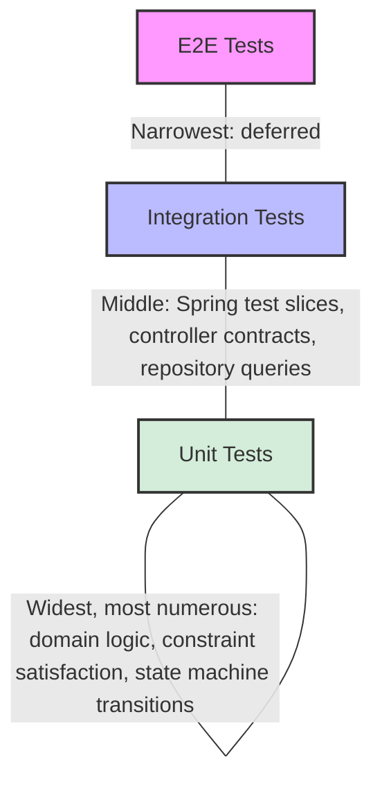

# Testing Strategy

## Philosophy

My testing approach follows a deliberate pyramid strategy with coverage concentrated where domain invariants provide the highest confidence-per-test. The acceptance criteria derived directly from our user stories (written in Gherkin in `product-idea/user-stories.md`) drove my test case design from the ground up.

## Test Pyramid



## Backend Testing Stack

- **Framework**: JUnit 5 + Spring Boot Test
- **Test Slices**: `@WebMvcTest` for controller contract tests, `@DataJpaTest` for entity and repository tests
- **Security Testing**: `spring-boot-starter-security-test` for filter and RBAC verification
- **Validation Testing**: `spring-boot-starter-validation-test` for bean validation
- **Coverage**: JaCoCo (>90% line coverage)
- **Report**: `backend/target/site/jacoco/index.html`

### What's Tested

- Bed state machine transitions (White → Green → Grey → Mustard Yellow → White)
- Constraint satisfaction engine (hard invariant rejection, soft constraint scoring)
- Two-tier constraint hierarchy (HTTP 422 for safety invariants, HTTP 400 for missing override reasons)
- Consensus completion gate (all broadcasts must complete before BMU dispatch)
- Safety-first discordance resolution (highest acuity, telemetry union)
- Acuity-driven SLA threshold calculations
- Dual-pathway KPI metric extraction (SQL and log parity)
- Optimistic locking (concurrent specialist claim rejection)

## Frontend Testing Stack

- **Framework**: Vitest 5 + Testing Library + happy-dom
- **Coverage**: V8 provider via @vitest/coverage-v8 (>90% line coverage)
- **Report**: `frontend/coverage/index.html`

### What's Tested

- Component rendering for each persona view
- Role-based route guards and navigation
- Form validation and submission flows
- TanStack Query data fetching and cache behavior
- Milestone stepper state transitions
- Financial explainer calculations and display

## E2E Testing — A Deliberate Deferral

I have deliberately deferred E2E browser tests (using tools like Playwright or Cypress) as a production investment. In this prototype, authentication is entirely header-driven (meaning there is no login flow to test), our data is synthetic and deterministic, and external gateways are completely mocked. The domain logic layer — where clinical safety correctness matters most — is thoroughly covered by my unit and integration tests. For a production deployment, E2E tests would be introduced to validate real OAuth2/Singpass login flows, actual browser rendering across various devices, and end-to-end data persistence.

## Running Tests

### Backend

```bash
cd backend
./mvnw test                    # Run all tests
./mvnw verify                  # Run tests + generate JaCoCo report
```

### Frontend

```bash
cd frontend
npm test                       # Run all tests
npm run test:coverage          # Run with V8 coverage
```

## Coverage Philosophy

While coverage percentage is a necessary quality metric, it is ultimately insufficient on its own. The true value lies not in the number itself, but in *what* is covered. Clinical safety invariants, constraint satisfaction correctness, and state machine transitions are the high-value targets in this system, as bugs in these areas would have a direct, adverse impact on patient care. Therefore, my testing efforts have been deeply focused on these critical pathways.
