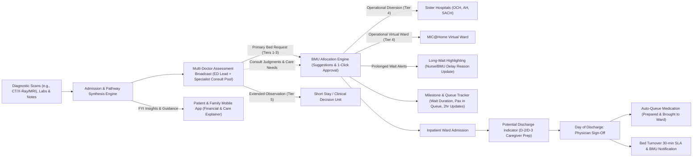

# Intelligent Patient Flow & Bed Capacity Orchestration System

## Product Definition & Architecture Specification

---

### 1. Executive Summary

The application unifies **Emergency Department (ED) Admission Decision Support** with **Bed Management Unit (BMU) Capacity Orchestration** and **Discharge-to-Turnover Logistics**.

By synthesizing diagnostic scans and clinical notes into pre-populated assessment templates for a **Multi-Doctor Assessment Broadcast** (led by the primary ED attending with parallel consult broadcasts to specialty feeds), dispatching direct digital bed requests to BMU based on severity tiers (eliminating phone calls), empowering BMU to orchestrate diversion to Sister Hospitals and Hospital-at-Home based on primary and specialist doctors' clinical assessments, providing transparent admission queue visibility (estimated wait duration, pax in queue, milestone updates every 2 hours) to patients/families upon bed request dispatch, highlighting long-waiting cases, and auto-queuing bedside discharge medications, the system optimizes bed capacity, accelerates admissions, and reduces exit blockages.

---

### 2. Sharpened Pain Points & Root Cause Analysis

| # | Observed Pain Point | Root Cause Analysis | System Solution |
| --- | --- | --- | --- |
| **1** | **Multi-Doctor Admission Decision Latency** | Multiple decision points and consultations are required across multiple doctors before an admission decision is reached for the average case, causing diagnostic deliberation lag. | **Automated Diagnostic Synthesis & Multi-Doctor Assessment Broadcast:** Aggregates scan reports (CT/X-Ray/MRI), blood tests, vitals, and clinical notes to pre-populate smart assessment templates. The primary ED attending leads and submits the initial admission assessment and bed tier request, while an asynchronous consult broadcast is routed to broad service-cluster on-call specialist feeds (with automated fallback to a default on-call specialist if unclaimed). If specialists identify higher acuity or critical care needs, BMU automatically escalates queue priority under a safety-first policy, presenting both judgments side-by-side for clinical alignment. |
| **2** | **ED-to-BMU Manual Phone Bed Requests** | New bed requests are placed via synchronous manual phone calls and fragmented notes to the Bed Management Unit (BMU), leading to phone tag, miscommunicated clinical criteria, and delayed bed placement. | **Direct Digital BMU Bed Requests:** Direct digital dispatch of structured admission packets ordered by severity priority (Tiers 1–5), eliminating synchronous phone calls and providing instant queue visibility. |
| **3** | **Under-utilized Diversion (Sister Hospitals & Hospital-at-Home)** | Clinicians default to tertiary acute beds because cross-referrals to community hospitals (OCH, AH, SACH) or Hospital-at-Home (MIC@Home) require burdensome manual paper packets, bilateral phone approvals, and patient counseling. | **Deterministic Care-Pathway Matcher:** Automatically evaluates clinical eligibility rules upon admission order and generates 1-click standardized referral packets with financial/care explainer for patients. These financial/care explainers are routed to the patient's/authorised family member's mobile application for insights and considerations. |
| **4** | **"Ghost Capacity" from Multi-Bed Cubicle Gender/Pathogen Locking** | In Class B2/C wards, 1 patient's gender or infection status locks all remaining beds in a 4- to 6-bed cubicle. Ad-hoc allocation causes empty beds that cannot be used. | **Three-State (White/Green/Grey) Bed Orchestration & Dynamic Holding Room Batching:** Implements a strict bed state machine (`White` = empty/clean, `Green` = assigned/in-transit, `Grey` = occupied). Algorithm runs a two-phase strategy: Phase 1 packs patients into existing partially filled cubicles matching their Ward Class (C, B2, B1, A), gender, and infection status. Phase 2 clusters remaining waiting patients and proactively recommends designating all-White cubicles into dedicated 'Holding Rooms' for batch admission. Includes dynamic 'Cohort-Swap' re-optimizations to reassign isolated Green patients before ED departure, freeing entire cubicles for large surge cohorts. |
| **5** | **Lack of Patient & Family Queue & Wait Duration Visibility** | Patients and their family members currently have no visibility on duration and the number of pax in queue for hospital beds; non-FIFO queues make countdown timers inaccurate, escalating anxiety and abuse of triage nurses. | **Milestone & Queue Tracker:** Transparent visibility for patients and authorized family members to view estimated wait duration and number of pax in queue with periodic updates (e.g. every 2 hours), alongside nurse/BMU-conveyed operational delay reasons. |
| **6** | **Manual Discharge Caregiver Prep & Medication Bottlenecks** | Patient discharges are handled manually where nurses have to engage family members and caregivers late; discharge medications are queued and collected separately after morning rounds, creating afternoon exit block. | **Multi-Day Caregiver Runway & Auto-Queued Ward Medication:** Potential discharge indicators at D-2/D-3 prompt nurses to engage caregivers early; physician morning sign-off auto-queues discharge medications to be prepared and brought directly up to the ward during expected discharge, paired with a 30-minute housekeeping SLA. |

---

### 3. Application Features & Technical Workflows

#### Feature 1: Clinical Admission & Care-Pathway Routing Engine (ED Layer)

- **Automated Diagnostic Synthesis to Support Faster Admission:**
  - Ingests and extracts real-time clinical parameters: scan reports (CT, X-Ray, MRI), diagnostic imaging findings, laboratory panels (blood tests, troponin, cultures), vital signs, oxygenation levels, and clinical notes.
  - Automatically compiles an objective clinical summary to determine admission eligibility, pre-populating smart assessment templates with suspected diagnosis, recommended bed tier, and care requirements (e.g., telemetry, isolation, fall risk).
- **Multi-Doctor Assessment Broadcast Architecture:**
  - **Primary Clinician Assessment Lead:** The ED attending physician leads and submits the primary admission assessment. With pre-populated AI findings, the attending can confirm with 1 click or tweak dropdown chips (urgency tier, service, isolation/equipment tags) and attach clinical directives.
  - **Specialist Service Cluster Broadcast Pool:** Case dossiers are broadcasted simultaneously to an open on-call specialty consult feed filtered by broad service clusters (e.g., General Medicine, Cardiology, General Surgery, Orthopaedics) where specialists claim cases matching their clinical scope.
  - **Default On-Call Escalation Fallback:** If no specialist claims the broadcast within a defined SLA timeout window, the system automatically escalates and assigns the default designated on-call physician for that service cluster.
  - **Asynchronous Parallel Consult Input:** Responding specialists submit concurrent consultative assessments, specialty care directives, and diversion considerations into the dossier without blocking urgent bed dispatch.
  - **Safety-First Discordance & Acuity Escalation:** If a specialist's assessment specifies a higher acuity tier or critical care requirement than the ED attending's primary assessment, BMU automatically queues the bed request at the **higher acuity tier** for patient safety, displaying both clinical judgments side-by-side with a reconciliation prompt.
- **Alternative Care-Pathway Recommendations (Sister Hospitals & Hospital-at-Home):**
  - Evaluates clinical criteria to identify patients eligible for alternative care pathways:
    - **Hospital-at-Home (MIC@Home):** Identifies clinically stable conditions (e.g., uncomplicated pneumonia, cellulitis, fluid overload, UTI) eligible for acute virtual ward admission.
    - **Sister Hospitals (OCH, AH, SACH):** Recommends direct subacute transfer to community hospitals for rehabilitation and convalescent care.
  - *Operational Decision Authority:* BMU coordinators hold the operational authority to enact alternative diversion pathways, deciding allocations based on severity and care requirements stated by the primary doctor in consideration of specialist doctors' judgment.
- **5-Tier Bed Admission Priority Framework:**
  - **Tier 1: Critical / Resuscitation:** Immediate ICU / High Dependency (HD) bed placement; bypasses general queue with urgent clinical escalation.
  - **Tier 2: Acute Urgent:** High clinical urgency requiring continuous telemetry or close nursing observation in an acute inpatient ward.
  - **Tier 3: Acute Stable:** Moderate illness with stable vital signs, requiring standard inpatient medical/surgical management.
  - **Tier 4: Subacute / Potential Diversion:** Clinically stable patient eligible for step-down rehabilitation at a Sister Community Hospital (OCH, AH, SACH) or virtual care via MIC@Home.
  - **Tier 5: Observation / Short-Stay:** Stable patient requiring brief extended monitoring (<24–48h) in the Short Stay Unit (SSU) or Clinical Decision Unit (CDU).
- **Unified Digital Admission Packet Extraction:**
  - Auto-extracts vitals, patient disposition (service, fall risk, mobility/ADL score, wandering/dementia precautions), diagnosis, gender, infection status/isolation type, and special care/equipment requirements (telemetry, negative pressure, bariatric bed, dialysis).
- **In-App Financial & Care Explainer (FYI Insights):**
  - Routes an interactive informational explainer to the patient's / authorized family member's mobile health app and SMS link.
  - Outlines estimated MediSave/subsidy co-pays, expected rehabilitation timeline, and care expectations for consideration.
  - Does not require formal digital sign-off (informational advisory for patient peace of mind).
  - Includes direct action buttons/contacts to connect immediately with Medical Social Work (MSW) or hospital Financial Counseling if financial or care assistance is required.

#### Feature 2: Direct BMU Bed Queue & Constraint-Satisfaction Allocation (Logistics Layer)

- **Direct Digital Bed Requests (Zero Phone Calls):**
  - Upon ED attending primary assessment, acute admission requests (Tiers 1–3) are dispatched directly and electronically into the Bed Management Unit (BMU) queue indexed by severity priority, eliminating manual phone calls and fragmented notes. Consulting specialist assessments stream in asynchronously, appending to the live BMU request packet.
- **Sister Hospital & Diversion Operational Authority:**
  - Evaluates pending requests and presents recommendations directly to BMU coordinators. BMU coordinators make the operational routing decision for alternative diversion pathways to Sister Hospitals (OCH, AH, SACH) or MIC@Home, based on the severity and care requirements articulated by the primary doctor in consideration of consulting specialist doctors' judgment.
- **Clinical Discordance Review on BMU Dashboard:**
  - When primary attending and consulting specialists diverge on acuity or care requirements, BMU is alerted with side-by-side clinical comparisons, defaulting to higher acuity reservation under the safety-first policy.
- **Long-Waiting Patient Highlighting & Nursing Delay Communication:**
  - Algorithm continuously monitors queue dwell times against priority SLAs.
  - Patients experiencing prolonged waits are highlighted with visual escalation flags on the BMU dashboard.
  - Prompts BMU coordinators and ED floor nurses with the underlying operational delay reason (e.g., specialized isolation turnover, emergency trauma surges) so nurses can proactively convey the explanation directly to the patient/family.
- **Intelligent Bed Suggestions with Human-in-the-Loop Override:**
  - Constraint-satisfaction engine scores beds against hard constraints (isolation, gender cohorting, mandatory equipment, priority SLA) and soft optimization constraints (service clustering, fall risk proximity, turnover timing).
  - Presents the **Top 3 Recommended Beds** with match rationale to BMU coordinators for **1-click approval**.
  - Allows manual coordinator override with mandatory structured reason capture (driving continuous algorithmic tuning).
- **Three-State Bed Lifecycle Machine (`White` / `Green` / `Grey`):**
  - **`White` (Available & Clean):** Vacant, sanitized by housekeeping, and immediately available for allocation.
  - **`Green` (Assigned / In-Transit):** Allocated by BMU to an ED patient (or batch holding cohort), but the patient has not yet physically arrived at the ward.
  - **`Grey` (Taken / Physically Occupied):** Patient has arrived at the ward, completed reception, and is physically occupying the bed.
  - *Turnover Transition Gate:* When a patient is discharged, the bed remains unavailable during the 30-minute housekeeping SLA, turning **`White`** only upon terminal cleaning sign-off $\rightarrow$ **`Green`** upon BMU allocation $\rightarrow$ **`Grey`** upon physical ward reception.
- **Dynamic Flex-Cubicle Batching & Holding Room Algorithm:**
  - **Cubicle Cohort Locking:** Multi-bed cubicles (Class B1: 4 beds; Class B2: 5–6 beds; Class C: open partitioned cubicles) lock to a composite key: $\langle \text{Ward Class (C/B2/B1/A)}, \text{Gender}, \text{Infection Status} \rangle$.
  - **Phase 1 (Consolidation Packing):** Scans all partially filled cubicles (containing active `Grey`/`Green` beds alongside unassigned `White` beds). Matches waiting ED patients whose requested Ward Class, Gender, and Infection profile match the existing cohort lock, packing them into remaining `White` beds first to maximize room utilization and protect all-`White` cubicles from premature single-patient locking.
  - **Phase 2 (Holding Room Creation & Batch Allocation):** For remaining unassigned patients, the algorithm analyzes waiting queue demographics and clusters them by Ward Class, Gender, and Infection Status. When a cluster reaches threshold ($\ge 3$ patients), it identifies an all-`White` flex cubicle and surfaces a proactive **"Holding Room Recommendation"** card to BMU coordinators. With 1-click BMU approval, all targeted beds transition simultaneously from `White` $\rightarrow$ `Green`, and coordinated batch porter dispatch is initiated.
  - **Dynamic Cohort-Swap / Re-Batching Optimization (`Green` Bed Flexibility):** `Green` beds hold a provisional cohort lock. If an influx of patients from another high-density cohort arrives in ED, and an otherwise empty cubicle is blocked by only 1–2 `Green` assignments whose patients have **not yet departed the ED**, the engine surfaces a **"Cohort-Swap Suggestion"** to BMU: reassigning the isolated `Green` patient(s) to alternative matching beds in partially filled cubicles. This unlocks the entire cubicle back to all-`White`, enabling it to be repurposed immediately into a batch holding room for the larger waiting cluster.

#### Feature 3: Patient & Family Milestone & Queue Tracker (Public Layer)

- **Dispatch-Activated Tracking:**
  - Activates at Milestone 1 (`Admission Decision Confirmed & Bed Requested`) once the primary ED attending completes the assessment and dispatches to BMU, preventing confusion or false alarms while clinical deliberation is ongoing.
- **Queue Depth & Estimated Duration Transparency:**
  - Displays the estimated admission wait duration and the number of pax in queue, combining acuity-tier standing with overall ED bed queue context to set realistic expectations.
- **Periodic Updates (Every 2 Hours):**
  - Automatically pushes refreshed queue status updates every 2 hours or upon milestone progression to patient and authorized family members via SMS link and mobile health app.
- **Prolonged Wait Explanation & Feedback Loop:**
  - Transparently displays nurse/BMU-conveyed reasons for prolonged delays (*e.g., "ED is actively managing high-acuity resuscitation cases; critical patients are being prioritized", "Deep terminal sanitization in progress"*), eliminating confrontational information voids.
- **Transparent Milestone Stages:**
  1. `Admission Decision Confirmed & Bed Requested (Assigned Priority Tier)`
  2. `Matching Ward & Bed Profile (Specialty, Equipment, Room Config)`
  3. `Bed Assigned – Preparing Room & Sanitization`
  4. `Porter Dispatched – Transfer to Inpatient Ward [Ward X]`
- **Integrated Care Insights Module:**
  - Embeds the FYI Financial & Care Explainer card for step-down/diversion candidates directly within the tracker view, accompanied by hotlines to Medical Social Work and financial counseling.

#### Feature 4: 2-Stage Discharge & Bed Turnover Orchestration (Inpatient Layer)

- **Stage 1: Multi-Day Runway & Potential Discharge Indicator (D-2 / D-3):**
  - Attending physician enters Estimated Date of Discharge (EDD) with confidence indicators during morning rounds.
  - Highlights a **Potential Discharge Indicator** on the ward management dashboard, enabling nurses to prioritize and reach out earlier to engage patient caregivers and family members on discharge preparation (home environment prep, insulin/wound training, transport booking) to ease workload.
- **Stage 2: Day-of-Discharge Execution & Auto-Queued Bedside Medication:**
  - Physician signs off morning discharge order $\rightarrow$ instantly triggers an **Automated Discharge Medication Queue**.
  - Pharmacy pre-packs medications and ward runners bring them directly up to the ward/bedside during expected discharge, eliminating the disjointed experience of separate pharmacy counter pickup.
  - Nurse marks *"Patient Vacated"* $\rightarrow$ automated housekeeping dispatch with 30-minute terminal cleaning SLA $\rightarrow$ auto-notifies BMU of clean bed availability.

---

### 4. Key Performance Indicators (KPIs)

*The KPIs below are mapped directly 1-to-1 to each of the sharpened Pain Points:*

#### 1. Multi-Doctor Assessment Turnaround & Collaboration (Pain Point 1)

- **Primary ED Assessment Turnaround Time:** Average elapsed time from diagnostic data compilation to ED attending assessment submission.
- **Specialist Broadcast Pick-Up & Response Latency:** Average elapsed time for on-call specialists to claim the broadcast and submit consultative evaluations.
- **Primary vs Specialist Concordance Rate:** Percentage of cases where the primary ED attending and consulting specialists align on bed tier and care pathway.
- **Number & % of Accepted Admissions Based on System Recommendations:** Total volume and percentage of admissions confirmed following the diagnostic synthesis and multi-doctor assessment broadcast.

#### 2. Direct Digital BMU Bed Requests & Severity Urgency (Pain Point 2)

- **Number & % of Accepted Requests by Severity Tier:** Total volume and breakdown of accepted bed requests received digitally by the BMU, categorized by clinical acuity (Tiers 1–5).
- **BMU Telephone Call Volume Reduction:** Percentage decrease in incoming and outgoing phone calls between ED clinicians, wards, and BMU coordinators.
- **BMU Suggestion Acceptance Rate:** Percentage of system-recommended bed allocations accepted by BMU coordinators via 1-click approval without manual override.

#### 3. Diversion & Sister Hospital Routing (Pain Point 3)

- **Number & % of Accepted Requests Routed to Sister Hospitals & Virtual Beds:** Total volume and percentage of eligible patients diverted to Sister Community Hospitals (OCH, AH, SACH) and Hospital-at-Home (MIC@Home).
- **Sister Hospital Bilateral Acceptance Latency:** Percentage of transfer packets reviewed and accepted within the 30-minute bilateral SLA.

#### 4. Gender & Multi-Bed Capacity Optimization (Pain Point 4)

- **Effective Bed Capacity Utilization Gain:** Percentage increase in occupied operational beds achieved via flex-batching without adding physical real estate.
- **Reduction in Single-Gender & Infection Ghost Bed Lockouts:** Number of bed-hours recovered from previously blocked beds in multi-bed cubicles due to gender cohort or infection mismatch.
- **Batch Holding Room Adoption Rate:** Percentage of waiting ED admissions transferred via proactive batch holding room recommendations vs. ad-hoc single bed placements.
- **Cohort-Swap Optimization Yield:** Frequency and bed-hours recovered through dynamic Green bed cohort-swap reallocations.

#### 5. Patient & Family Queue & Wait Visibility (Pain Point 5)

- **Patient & Family Portal Login & Access Rate:** Number and percentage of patients and authorized family members logged in to check the estimated admission wait time, duration, and number of pax in queue.
- **2-Hour Periodic Update Delivery Rate:** Percentage of waiting patients who successfully receive automated 2-hour periodic status refreshes.
- **Prolonged-Wait Communication Rate:** Percentage of highlighted long-waiting patients whose operational delay reasons are documented by nurses/BMU and displayed on the patient tracker.
- **Reduction in ED Nursing Wait-Time Inquiries & Complaints:** Percentage decrease in patient/caregiver complaints and status inquiries logged by ED triage nurses.

#### 6. Discharge Logistics & Bed Turnover (Pain Point 6)

- **Discharge Before 12:00 PM:** Percentage of patients vacating acute inpatient beds prior to midday.
- **Early Caregiver Engagement Completion Rate:** Percentage of potential discharge cases whose caregiver training and transport arrangements are completed prior to the morning of discharge.
- **Bedside Discharge Medication Delivery Adoption:** Percentage of discharge prescriptions automatically prepared and brought directly up to the ward during expected discharge.
- **Bed Turnover Cleaning Latency:** Percentage of vacated beds cleaned and marked `Clean & Available` within the 30-minute housekeeping SLA.
