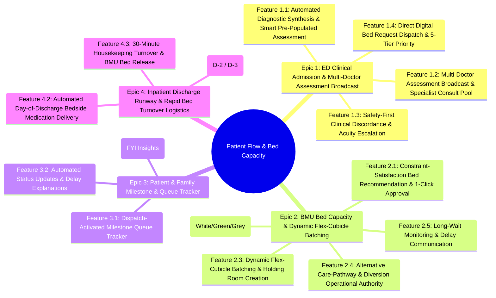

# User Stories & Acceptance Criteria Specification

## Intelligent Patient Flow & Bed Capacity Orchestration System

---

## Document Overview

This document translates the product definition, architectural flows, and clinical workflows defined in [`pain-points.md`](file:///Users/tjunrong/Documents/playground/enhance-hospital-admissions/product-idea/pain-points.md) into structured Epics, Features, User Stories, and Acceptance Criteria using Gherkin syntax (`Given / When / Then`).

---

## Summary Hierarchy



---

# Epic 1: ED Clinical Admission & Multi-Doctor Assessment Broadcast

## Feature 1.1: Automated Diagnostic Synthesis & Smart Pre-Populated Assessment

### Story 1.1.1: Clinical Parameter Ingestion & Acuity Synthesis

**As an** Emergency Department (ED) Attending Physician,  
**I want** the system to ingest and synthesize real-time diagnostic scan reports, laboratory panels, vital signs, and clinical notes,  
**So that** I have an objective, consolidated clinical baseline and recommended admission acuity score without manually collating fragmented EHR reports.

```gherkin
Scenario: Successful clinical parameter synthesis for an acute medical patient
  Given patient "P101" has received completed lab reports (Troponin 150 ng/L, elevated WBC), an ECG report, and recent vital signs (BP 95/60, SpO2 93%) in the EHR
  When the Diagnostic Synthesis Engine processes the new diagnostic arrivals
  Then the engine compiles an objective clinical summary for patient "P101"
  And calculates an initial acuity recommendation of "Tier 2: Acute Urgent"
  And pre-populates suspected diagnosis as "Non-ST Elevation Myocardial Infarction (NSTEMI)"
  And flags care requirements as "Continuous Telemetry" and "Fall Risk Precautions"

Scenario: Handling pending diagnostic imaging results
  Given patient "P102" has completed laboratory tests but an ordered CT brain scan is marked "In Progress"
  When the synthesis engine compiles the admission dossier
  Then the dossier reflects all completed lab values and vitals
  And displays a warning banner stating "Diagnostic Imaging (CT Brain) Pending"
  And allows the ED Attending to review interim findings without prematurely finalizing acuity
```

---

### Story 1.1.2: Pre-Populated Smart Assessment Form & 1-Click Submission

**As an** ED Attending Physician,  
**I want** a smart admission assessment form pre-populated with AI-synthesized findings that I can approve in 1 click or adjust via interactive dropdown chips,  
**So that** I can complete comprehensive clinical assessments in seconds without cognitive overload or manual data re-entry.

```gherkin
Scenario: ED Attending approves pre-populated assessment with 1-click
  Given the ED Attending opens the admission dossier for patient "P101"
  And the system has pre-populated "Bed Tier: Tier 2 (Acute Urgent)", "Admitting Specialty: Cardiology", and "Ward Class Preference: B2"
  When the ED Attending clicks "Confirm & Lead Assessment"
  Then patient "P101"'s primary assessment status changes to "Primary Assessment Submitted"
  And an admission bed request is stamped with the attending's digital signature and timestamp

Scenario: ED Attending adjusts urgency tier and care constraints via dropdown chips
  Given the ED Attending opens the admission dossier for patient "P103" where AI recommended "Tier 3: Acute Stable"
  When the ED Attending selects the "Urgency Tier" chip and changes it to "Tier 2: Acute Urgent"
  And adds the chip "Contact Isolation (MRSA)"
  And clicks "Confirm & Lead Assessment"
  Then the system records the updated "Tier 2" acuity and "Contact Isolation" constraint
  And logs the clinician modification in the audit trail
```

---

## Feature 1.2: Multi-Doctor Assessment Broadcast & Specialist Consult Pool

### Story 1.2.1: Service Cluster Broadcast Dispatch & On-Call Feed

**As an** ED Attending Physician,  
**I want** the system to broadcast the synthesized assessment dossier to open on-call specialty feeds categorized by broad service clusters,  
**So that** relevant inpatient specialists can immediately review and contribute concurrent clinical evaluations without sequential consultation bottlenecks.

```gherkin
Scenario: Automated broadcast to Cardiology service cluster on-call feed
  Given the ED Attending initiates assessment for patient "P101" with suspected NSTEMI
  When the system determines the primary service cluster as "Cardiology / Internal Medicine"
  Then the patient dossier is broadcasted simultaneously to the active "Cardiology On-Call Feed"
  And all logged-in Cardiology on-call specialists receive a high-priority notification with patient summary and scan links

Scenario: Specialist claims a broadcasted case from the cluster feed
  Given Dr. Tan is logged in as an on-call Cardiology Consultant
  And sees patient "P101" listed as "Open for Consult" in the Cardiology On-Call Feed
  When Dr. Tan clicks "Claim Case"
  Then the status of patient "P101" in the feed updates to "Under Review by Dr. Tan"
  And other specialists in the cluster see that Dr. Tan has accepted the case
```

---

### Story 1.2.2: Unclaimed Broadcast SLA Timeout & Default On-Call Auto-Assignment

**As an** ED Floor Nurse and Clinical Administrator,  
**I want** the system to automatically assign an unclaimed broadcast to the designated default on-call specialist if no doctor picks it up within the SLA window,  
**So that** patient consult reviews are never delayed by inactive feeds or unmonitored queues.

```gherkin
Scenario: SLA timeout triggers automatic assignment to default on-call specialist
  Given patient "P104" was broadcasted to the "General Surgery On-Call Feed" at "21:00"
  And the cluster SLA timeout window is configured to 20 minutes
  And no specialist has claimed the case by "21:20"
  When the SLA timer expires
  Then the system automatically assigns the case to "Dr. Lee (Default On-Call General Surgeon)"
  And dispatches an urgent push notification and SMS alert to Dr. Lee
  And logs "Auto-Escalated: Cluster SLA Timeout Exceeded" in the case audit log
```

---

### Story 1.2.3: Asynchronous Parallel Specialist Consult Input

**As an** On-Call Inpatient Specialist Consultant,  
**I want** to asynchronously submit my specialized clinical assessment, required monitoring, and step-down recommendations directly into the active dossier,  
**So that** my clinical inputs inform bed placement and care planning without blocking immediate emergency bed queuing.

```gherkin
Scenario: Specialist submits concurrent consult assessment without blocking queue
  Given Dr. Tan has claimed the consult review for patient "P101"
  When Dr. Tan submits:
    | Field                     | Value                                   |
    | Specialist Impression     | High-Risk NSTEMI; planned for early cath |
    | Bed Tier Recommendation   | Tier 2 (Acute Urgent - Telemetry)       |
    | Specialty Admitting Team  | Inpatient Cardiology Team 2             |
    | Diversion Suitability     | Ineligible for HaH or Community Hospital|
  Then the consult evaluation is appended to patient "P101"'s live admission packet
  And the BMU coordinator dashboard displays Dr. Tan's specialist endorsement in real time
```

---

## Feature 1.3: Safety-First Clinical Discordance & Acuity Escalation

### Story 1.3.1: Discordant Assessment Detection & Automatic Acuity Escalation

**As a** BMU Coordinator and Patient Safety Officer,  
**I want** the system to automatically escalate the bed request priority to the higher acuity tier whenever the primary ED attending and consulting specialist submit conflicting acuity assessments,  
**So that** patients are never under-triaged or placed into insufficiently monitored beds during clinical disagreement.

```gherkin
Scenario: System automatically escalates bed tier to higher acuity upon discordance
  Given ED Attending submits primary assessment for patient "P105" as "Tier 3: Acute Stable (General Ward)"
  When consulting Specialist Dr. Lim submits assessment for patient "P105" as "Tier 2: Acute Urgent (Telemetry)"
  Then the system flags the admission packet with a "Clinical Discordance Alert"
  And sets the effective BMU allocation tier to "Tier 2: Acute Urgent"
  And assigns bed search parameters to require continuous cardiac telemetry
```

---

### Story 1.3.2: Side-by-Side Clinical Review & Clinician Alignment Prompt

**As a** BMU Coordinator,  
**I want** to see both the ED attending's and specialist's divergent clinical assessments displayed side-by-side on my dashboard with an alignment prompt,  
**So that** I understand the clinical rationale behind the divergence and can prompt clinicians to reconcile if necessary.

```gherkin
Scenario: BMU Coordinator views side-by-side discordance comparison
  Given patient "P105" has divergent assessments between ED Attending Dr. Wong (Tier 3) and Specialist Dr. Lim (Tier 2)
  When the BMU Coordinator opens patient "P105"'s bed request details
  Then the dashboard presents a dual-column comparison:
    | Attribute          | ED Attending (Dr. Wong)       | Specialist (Dr. Lim)         |
    | Acuity Tier        | Tier 3: Acute Stable          | Tier 2: Acute Urgent         |
    | Primary Need       | General Medical Monitoring    | Continuous Telemetry         |
    | Rationale          | Vitals stable, chest pain subsided | Troponin uptrending, high TIMI risk |
  And displays a "Prompt Clinician Reconcile" button to open a direct secure messaging thread between Dr. Wong and Dr. Lim
```

---

## Feature 1.4: Direct Digital Bed Request Dispatch & 5-Tier Priority Framework

### Story 1.4.1: Instant Digital BMU Queue Dispatch

**As an** ED Attending Physician,  
**I want** my signed admission assessment for acute cases (Tiers 1–3) to dispatch immediately into the digital BMU bed queue,  
**So that** manual phone calls, phone tag, and verbal miscommunication with bed planners are completely eliminated.

```gherkin
Scenario: Immediate digital bed request dispatch for acute cases
  Given the ED Attending completes the primary assessment for Tier 2 patient "P101"
  When the ED Attending clicks "Confirm & Lead Assessment"
  Then the digital bed request is instantly published to the BMU Active Queue
  And the queue position is indexed strictly by acuity tier (Tier 2) and admission timestamp
  And no phone call or manual confirmation is required between ED and BMU
```

---

### Story 1.4.2: Structured Admission Packet Generation

**As a** BMU Coordinator,  
**I want** incoming digital bed requests to contain auto-extracted structured parameters (Ward Class preference, gender, infection status, fall risk, mobility score, telemetry),  
**So that** my allocation algorithms have 100% complete data to match appropriate inpatient beds without calling the ED.

```gherkin
Scenario: Admission packet contains all mandatory constraint attributes
  Given patient "P106" has a dispatched bed request
  When the BMU queue ingests the request packet
  Then the packet contains structured attributes:
    | Attribute               | Extracted Value             |
    | Patient ID              | P106                        |
    | Gender                  | Female                      |
    | Ward Class Preference   | Class B2                    |
    | Infection Status        | Non-Infectious              |
    | Acuity Tier             | Tier 3 (Acute Stable)       |
    | Equipment Needs         | Standard Bed, Fall Alarm    |
    | Mobility / ADL Score    | Semi-Ambulatory (Requires 1-person assist) |
```

---

# Epic 2: BMU Bed Capacity & Dynamic Flex-Cubicle Batching

## Feature 2.1: Constraint-Satisfaction Bed Recommendation & 1-Click Approval

### Story 2.1.1: Multi-Constraint Scoring Engine

**As a** BMU Coordinator,  
**I want** an automated constraint engine that scores all available beds against hard constraints (isolation, gender cohorting, mandatory equipment, SLA) and soft constraints (service clustering, fall risk proximity),  
**So that** bed matches are clinically safe, operationally optimal, and computed instantly.

```gherkin
Scenario: Hard constraint filtering eliminates mismatched beds
  Given patient "P107" is a Male requiring "Negative Pressure Isolation" and "Ward Class B2"
  And the hospital has 20 empty beds, but only 2 beds are in Negative Pressure Isolation rooms
  When the constraint satisfaction engine evaluates candidate beds
  Then all 18 standard beds are filtered out with reason "Hard Constraint Failure: Negative Pressure Required"
  And the 2 negative pressure beds are scored and presented as viable candidates

Scenario: Soft constraint optimization prioritizes service clustering
  Given patient "P108" is admitted under General Surgery
  And two candidate beds satisfy all hard constraints: Bed 7A-01 (Surgical Ward 7A) and Bed 9B-04 (Orthopaedic Ward 9B)
  When the engine scores both candidates
  Then Bed 7A-01 receives a higher soft score (+30 points for Service Clustering)
  And is ranked as Recommendation #1
```

---

### Story 2.1.2: Top-3 Bed Recommendations & 1-Click Coordinator Approval

**As a** BMU Coordinator,  
**I want** the system to present the Top 3 ranked beds with match rationale for 1-click approval, while capturing structured reasons if I override,  
**So that** routine bed placements take one second and edge-case manual overrides train the recommendation algorithm.

```gherkin
Scenario: BMU Coordinator approves Recommendation #1 in 1 click
  Given the BMU Coordinator selects waiting patient "P101"
  And the dashboard displays Top 3 recommended beds with Bed 8A-12 ranked #1 (Score: 94/100, "Ideal service match, telemetry equipped")
  When the coordinator clicks "Approve Recommendation #1"
  Then Bed 8A-12 is allocated to patient "P101"
  And the bed state immediately changes from "White" to "Green"

Scenario: BMU Coordinator overrides recommendation with mandatory structured reason
  Given the coordinator views recommendations for patient "P109"
  When the coordinator selects Bed 10C-02 (Rank #4) instead of the Top 3
  Then the system displays a modal: "Please select override rationale"
  And requires selection from structured options:
    | Option                                  |
    | Clinical Attending Special Request      |
    | Ward Nursing Staffing Constraint        |
    | Impending Cubicle Maintenance           |
  And the override reason is logged in the algorithmic feedback dataset
```

---

## Feature 2.2: Three-State Bed Lifecycle Machine (`White` / `Green` / `Grey`)

### Story 2.2.1: Bed State Transitions & Real-Time Status Tracking

**As a** BMU Coordinator and Ward Nurse,  
**I want** the system to enforce a strict three-state lifecycle (`White`, `Green`, `Grey`) across all inpatient beds,  
**So that** bed availability and transit states are transparent across ED, BMU, and ward staff.

```gherkin
Scenario: Bed transitions through full lifecycle from White to Green to Grey
  Given Bed 8B-01 is currently marked "White" (Clean, sanitized, and unallocated)
  When BMU allocates Bed 8B-01 to patient "P101"
  Then Bed 8B-01 transitions to "Green" (Assigned / In-Transit)
  And the cubicle is provisionally locked to patient "P101"'s cohort profile
  When patient "P101" is received by the ward nurse at Bed 8B-01 and checked in
  Then Bed 8B-01 transitions to "Grey" (Taken / Physically Occupied)
```

---

### Story 2.2.2: Cleaning Gate to White

**As a** Housekeeping Supervisor and BMU Coordinator,  
**I want** vacated beds to remain unavailable during the 30-minute terminal cleaning SLA and transition to `White` only after cleaning sign-off,  
**So that** uncleaned or contaminated beds are never prematurely allocated to waiting patients.

```gherkin
Scenario: Discharged bed remains unavailable until housekeeping completion
  Given patient "P090" vacates Bed 6A-03 and the nurse marks "Patient Vacated"
  When the bed enters the turnover workflow
  Then Bed 6A-03 transitions to status "Turnover Cleaning In Progress"
  And the bed cannot be selected or recommended as "White"
  When Housekeeping completes sanitization and taps "Clean & Inspected" on their mobile terminal
  Then Bed 6A-03 transitions to "White" (Available & Clean)
  And BMU receives an automated notification that Bed 6A-03 is ready for immediate allocation
```

---

## Feature 2.3: Dynamic Flex-Cubicle Batching & Holding Room Creation

### Story 2.3.1: Phase 1 Consolidation Packing

**As a** BMU Coordinator,  
**I want** the algorithm to prioritize assigning waiting ED patients into partially filled cubicles that already match their Ward Class, gender, and infection profile,  
**So that** existing room cohorts are fully utilized and all-`White` empty cubicles are preserved as dynamic flex buffers.

```gherkin
Scenario: Patient packed into matching partially filled cubicle
  Given Cubicle 7B-C1 (Class B2, 6-bed cubicle) contains 3 "Grey" beds (Male, Non-infectious) and 3 "White" beds
  And Cubicle 7B-C2 is an all-White cubicle (6 "White" beds, no active cohort lock)
  And waiting patient "P110" is Male, Non-infectious, requesting Class B2
  When the allocation engine evaluates bed placement for patient "P110"
  Then the engine recommends a "White" bed in Cubicle 7B-C1 under Phase 1 Consolidation Packing
  And preserves all-White Cubicle 7B-C2 uncommitted for cluster batching
```

---

### Story 2.3.2: Phase 2 Holding Room Recommendation & Batch Allocation

**As a** BMU Coordinator,  
**I want** the system to detect waiting queue clusters of $\ge 3$ patients sharing Ward Class, gender, and infection status, and proactively recommend converting an all-`White` cubicle into a dedicated Batch Holding Room,  
**So that** we can batch-admit 4–6 patients simultaneously, eliminate single-gender ghost capacity, and coordinate batch porter transfers.

```gherkin
Scenario: Engine triggers Batch Holding Room card for female respiratory cluster
  Given 4 patients in the ED bed queue are Female, requesting Class B2, with Non-infectious Respiratory status
  And Ward 8B Cubicle 3 is completely empty with 4 "White" beds
  When the Phase 2 batching engine runs its queue scan
  Then it surfaces a "Holding Room Recommendation" card on the BMU dashboard:
    | Recommendation Title | Designate Ward 8B Cubicle 3 as Female B2 Respiratory Holding Room |
    | Candidate Batch      | Patients P111, P112, P113, P114                                   |
    | Capacity Utilization | 4 of 4 beds (100% capacity, 0 ghost beds created)                 |
  When the BMU Coordinator clicks "Approve Batch Holding Room"
  Then all 4 beds in Ward 8B Cubicle 3 transition simultaneously from "White" to "Green"
  And a coordinated batch porter dispatch request is generated for all 4 patients
```

---

### Story 2.3.3: Dynamic Cohort-Swap Re-Optimization (`Green` Bed Flexibility)

**As a** BMU Coordinator,  
**I want** the engine to detect when an all-`White` cubicle is blocked by 1–2 `Green` assigned beds whose patients have not departed the ED, and suggest a 1-click "Cohort Swap" if a large surge of another cohort arrives,  
**So that** isolated reservations do not lock up whole cubicles needed for massive waiting clusters.

```gherkin
Scenario: Cohort swap frees cubicle for high-volume surge cluster
  Given Ward 9A Cubicle 1 (4 beds) has 1 "Green" bed assigned to Male patient "P115" (not yet departed ED) and 3 "White" beds
  And a surge of 4 Female Class B2 patients are waiting in ED with no other all-White cubicle available
  And Ward 9B Cubicle 2 has a partially filled Male cubicle with an available "White" bed
  When the engine detects the sub-optimal cohort lockout
  Then it alerts the BMU Coordinator with a "Cohort Swap Suggestion":
    | Proposed Action | Reassign Male patient P115 to Ward 9B Cubicle 2 Bed 03 |
    | Benefit         | Frees Ward 9A Cubicle 1 to batch-admit 4 waiting Female patients |
  When the coordinator clicks "Approve Cohort Swap"
  Then patient "P115"'s assignment switches to Ward 9B Cubicle 2 Bed 03 (remains "Green")
  And Ward 9A Cubicle 1 becomes 100% "White" and is immediately allocated to the 4 Female patients
```

---

## Feature 2.4: Alternative Care-Pathway & Diversion Operational Authority

### Story 2.4.1: BMU Sister Hospital Transfer Routing

**As a** BMU Coordinator,  
**I want** the system to present clinically eligible Tier 4 subacute cases for direct transfer to Sister Community Hospitals (OCH, AH, SACH) based on primary and specialist recommendations,  
**So that** acute tertiary beds are preserved for acute medical emergencies.

```gherkin
Scenario: BMU Coordinator approves Sister Hospital transfer packet
  Given patient "P116" is assessed as "Tier 4: Subacute" for post-stroke rehabilitation
  And consulting specialist endorses suitability for Outram Community Hospital (OCH)
  When the BMU Coordinator opens the Diversion Recommendation panel
  Then the system displays an automated 1-click OCH referral packet containing clinical summary, functional ADL score, and rehabilitation goals
  When the BMU Coordinator clicks "Dispatch Digital Referral to OCH"
  Then the standardized packet is transmitted electronically to OCH Bed Coordination
  And the 30-minute bilateral SLA acceptance timer is initiated
```

---

### Story 2.4.2: Hospital-at-Home (MIC@Home) Virtual Ward Allocation

**As a** BMU Coordinator,  
**I want** to route clinically stable acute conditions (uncomplicated cellulitis, UTI, mild fluid overload) to the MIC@Home virtual ward,  
**So that** eligible patients receive acute-level hospital care in their homes while freeing physical hospital beds.

```gherkin
Scenario: BMU Coordinator routes eligible patient to MIC@Home virtual bed
  Given patient "P117" is diagnosed with uncomplicated lower-limb cellulitis requiring IV antibiotics
  And the clinical criteria match all MIC@Home clinical and social safety rules
  When the BMU Coordinator selects "Admit to MIC@Home Virtual Ward"
  Then patient "P117" is assigned a Virtual Ward Bed ID (e.g., "MIC-V042")
  And the mobile care explainer is routed to the patient's phone
  And home-nursing and tele-monitoring setup orders are dispatched automatically
```

---

## Feature 2.5: Long-Wait Monitoring & Operational Delay Communication

### Story 2.5.1: Priority SLA Dwell Time Tracking & Visual Escalation Flags

**As a** BMU Coordinator and ED Floor Nurse,  
**I want** waiting patients who exceed their acuity-tier dwell SLA to be highlighted with visual escalation badges on our dashboards,  
**So that** delayed bed assignments are prioritized and investigated immediately.

```gherkin
Scenario: Long-waiting patient highlighted after exceeding SLA threshold
  Given Tier 2 patient "P118" has been waiting in the BMU bed allocation queue for 95 minutes
  And the Tier 2 admission SLA threshold is 60 minutes
  When the queue monitor executes its periodic check
  Then patient "P118" is marked with a flashing red badge "Prolonged Wait: +35m SLA Overrun"
  And moves to the top of the coordinator's attention queue
```

---

### Story 2.5.2: Delay Reason Tagging for Floor Nurses

**As an** ED Floor Nurse,  
**I want** BMU coordinators to record the operational cause of prolonged delays (e.g., specialized isolation turnover, emergency trauma surges) into structured delay tags,  
**So that** I can proactively explain the exact situation to the patient and their family to de-escalate anxiety.

```gherkin
Scenario: Nurse retrieves structured delay reason from BMU
  Given patient "P118" has an active "Prolonged Wait" alert
  When the BMU Coordinator tags the delay reason as "Specialized Terminal Isolation Sanitization in Progress on Ward 7B"
  Then the delay explanation appears on the ED Floor Nurse's triage console
  And the nurse can view talking points: "Inform family that negative pressure room is currently completing mandatory 30-minute UV sanitization"
```

---

# Epic 3: Patient & Family Milestone & Queue Tracker

## Feature 3.1: Dispatch-Activated Milestone Queue Tracker

### Story 3.1.1: Dispatch-Gated Activation

**As a** Patient or Authorized Family Member,  
**I want** my mobile queue tracker to activate only after the primary ED attending confirms admission and dispatches the bed request to BMU,  
**So that** I am not confused or alarmed by interim clinical deliberations before an admission decision is made.

```gherkin
Scenario: Tracker remains inactive while doctor assessment is in progress
  Given patient "P119" is undergoing multi-doctor assessment broadcast in ED
  When the patient opens their mobile health portal link
  Then the tracker displays "ED Triage & Diagnostic Evaluation in Progress"
  And does NOT display an admission queue number or bed countdown

Scenario: Tracker activates at Milestone 1 upon ED Attending dispatch
  Given the ED Attending signs off the primary admission assessment for patient "P119"
  When the bed request is dispatched to BMU
  Then patient "P119" receives an SMS notification with a secure tracker link
  And the mobile tracker advances to: "Milestone 1: Admission Decision Confirmed (Assigned Priority: Acute Urgency)"
```

---

### Story 3.1.2: Queue Depth & Estimated Wait Duration Visibility

**As a** Patient or Authorized Family Member,  
**I want** to see the estimated wait duration and the number of patients ahead of me in the bed queue,  
**So that** I have realistic expectations of the wait duration and understand why non-FIFO clinical priority applies.

```gherkin
Scenario: Patient views transparent queue status and realistic wait duration
  Given patient "P119" is in Milestone 1 awaiting bed placement
  When patient "P119" views the mobile queue tracker
  Then the screen displays:
    | Metric                | Display Value                                |
    | Estimated Wait        | Approximately 2 hours 15 minutes             |
    | Queue Depth           | 5 patients ahead in matching ward category   |
    | Priority Tier Context | "Your priority tier is based on acute clinical stability" |
```

---

## Feature 3.2: Automated Status Updates & Delay Explanations

### Story 3.2.1: 2-Hour Periodic Refreshes & Push Notifications

**As a** Patient or Authorized Family Member,  
**I want** to receive automatic status updates pushed to my phone every 2 hours or whenever my milestone progresses,  
**So that** I remain informed without repeatedly asking the busy ED triage nurse for updates.

```gherkin
Scenario: Patient receives automated 2-hour queue refresh
  Given patient "P119" has been waiting in the bed queue for 2 hours since the last milestone update
  When the 2-hour scheduler triggers
  Then an automated SMS and push notification is sent to the patient and authorized family contact
  And the message reads: "Update on your hospital admission: Your bed request is actively being matched. Current estimated wait: ~45 mins. Milestone: Preparing Ward Bed Profile."
```

---

### Story 3.2.2: Transparent Operational Delay Disclosures

**As a** Patient or Authorized Family Member,  
**I want** the tracker to display clear, empathetic explanations when delays occur,  
**So that** I understand why the wait is prolonged rather than experiencing an information void.

```gherkin
Scenario: Patient tracker displays transparent operational delay explanation
  Given patient "P118"'s admission wait has been tagged by BMU with "Terminal Isolation Sanitization in Progress"
  When the patient views their tracker
  Then the screen displays an informational notice: "Your specialized isolation room is undergoing deep terminal sanitization for your safety. Preparing clean bed now."
  And provides a direct button to message the ward liaison
```

---

## Feature 3.3: Patient Financial & Care Explainer (FYI Insights)

### Story 3.3.1: Interactive Financial Advisory & Subsidy Breakdown

**As a** Patient or Authorized Caregiver,  
**I want** to view an interactive financial explainer showing estimated co-pays, MediSave coverage, and expected rehabilitation timelines if step-down care is recommended,  
**So that** I can make informed care choices without unexpected financial shocks.

```gherkin
Scenario: Patient reviews financial explainer for Community Hospital transfer
  Given patient "P116" is recommended for transfer to Outram Community Hospital (OCH)
  When the patient taps "View Care & Financial Insights" in their tracker
  Then the explainer card displays:
    | Item                         | Amount / Details                       |
    | Estimated Daily Subsidy Rate | 70% Means-Tested Government Subsidy    |
    | Estimated Out-of-Pocket Cost | $45 – $75 per day after MediSave       |
    | Average Rehabilitation Stay  | 14 – 21 days                           |
  And states: "This is an informational estimate for your peace of mind; no digital signature required."
```

---

### Story 3.3.2: Medical Social Work & Financial Counseling Action Buttons

**As a** Patient or Authorized Family Member,  
**I want** direct quick-dial and contact buttons to connect with Medical Social Work (MSW) or Financial Counseling within the explainer,  
**So that** I can immediately seek assistance if I have financial concerns or caregiver constraints.

```gherkin
Scenario: Caregiver connects with Medical Social Work via 1 click
  Given the caregiver is reviewing the financial explainer card for patient "P116"
  When the caregiver clicks "Speak to Medical Social Worker"
  Then the app initiates a direct hotline call to the hospital MSW office
  And pre-attaches patient "P116"'s admission reference number to the inquiry
```

---

# Epic 4: Inpatient Discharge Runway & Rapid Bed Turnover Logistics

## Feature 4.1: Multi-Day Runway & Potential Discharge Indicator (D-2 / D-3)

### Story 4.1.1: Estimated Date of Discharge (EDD) Entry & Ward Highlighting

**As an** Inpatient Attending Physician,  
**I want** to enter the Estimated Date of Discharge (EDD) with a confidence level during morning ward rounds,  
**So that** ward nurses and care coordinators can identify potential discharges 2 to 3 days in advance.

```gherkin
Scenario: Physician enters EDD during morning rounds
  Given Inpatient Physician Dr. Koh conducts morning rounds on patient "P088" on Monday
  When Dr. Koh sets EDD as "Wednesday (D-2)" with "High Confidence"
  Then the ward dashboard displays a "Potential Discharge Indicator (D-2)" next to patient "P088"
  And alerts the ward charge nurse to initiate discharge preparation protocols
```

---

### Story 4.1.2: Proactive Early Caregiver Engagement

**As an** Inpatient Ward Nurse,  
**I want** early system prompts to engage caregivers 2 to 3 days prior to discharge for home environment preparation, insulin/wound care training, and transport booking,  
**So that** afternoon discharge delays caused by unprepared caregivers are eliminated.

```gherkin
Scenario: Ward nurse completes early caregiver readiness checklist
  Given patient "P088" is flagged with a "Potential Discharge Indicator (D-2)"
  When the ward nurse opens the caregiver discharge runway checklist
  Then the checklist requires verification of:
    | Task                             | Status       |
    | Caregiver Insulin Training       | In Progress  |
    | Home Oxygen Concentrator Setup   | Completed    |
    | Non-Emergency Transport Booking  | Scheduled    |
  When all items are checked "Completed" prior to the discharge morning
  Then the discharge readiness flag turns "Green: Ready for Midday Discharge"
```

---

## Feature 4.2: Automated Day-of-Discharge Bedside Medication Delivery

### Story 4.2.1: Morning Physician Sign-Off & Auto-Queued Prescriptions

**As an** Inpatient Attending Physician and Inpatient Pharmacist,  
**I want** the physician's morning discharge sign-off to immediately trigger the automated inpatient pharmacy dispensing queue,  
**So that** discharge medications are pre-packed hours before the patient vacates the bed without requiring separate counter queuing.

```gherkin
Scenario: Morning doctor sign-off triggers automated discharge pharmacy queue
  Given patient "P088" has all clinical criteria met for discharge on Wednesday morning at "09:30"
  When the attending physician clicks "Final Discharge Sign-Off"
  Then the discharge prescription packet is automatically routed to the Inpatient Pharmacy Dispensing Queue
  And the pharmacy queue flags the order with an expedited "Discharge Medication: Target Delivery by 11:00 AM" SLA
```

---

### Story 4.2.2: Bedside Medication Delivery by Ward Runners

**As an** Inpatient Ward Nurse and Ward Med Runner,  
**I want** pre-packed discharge medications to be brought directly up to the patient's bedside by ward runners,  
**So that** patients and families do not have to wait at the outpatient pharmacy counter before heading home.

```gherkin
Scenario: Ward runner delivers discharge medications directly to bedside
  Given the pharmacy has pre-packed discharge medications for patient "P088" at "10:45 AM"
  When the Ward Med Runner accepts the delivery task and brings medications to Bed 8B-04
  Then the ward nurse scans the medication barcodes and patient wristband to confirm bedside receipt
  And the patient discharge tracker updates: "Medications Received at Bedside — Ready to Vacate"
```

---

## Feature 4.3: 30-Minute Housekeeping Turnover & BMU Bed Release

### Story 4.3.1: Nurse Vacate Trigger & Housekeeping Dispatch

**As an** Inpatient Ward Nurse,  
**I want** to click "Patient Vacated" the moment a patient departs the ward,  
**So that** housekeeping is immediately dispatched with a 30-minute terminal cleaning SLA.

```gherkin
Scenario: Nurse marks patient vacated and triggers automated housekeeping dispatch
  Given patient "P088" has departed Ward 8B Bed 04 at "11:30 AM"
  When the ward nurse taps "Patient Vacated" on the ward console
  Then Bed 8B-04 status changes from "Grey" to "Turnover Cleaning In Progress"
  And an automated cleaning dispatch task with a 30-minute SLA countdown is routed to the on-duty Environmental Services (EVS) mobile terminal
```

---

### Story 4.3.2: Clean Bed Sign-Off & Automatic Flip to `White`

**As a** Housekeeping / Environmental Services (EVS) Specialist and BMU Coordinator,  
**I want** to sign off terminal cleaning on my mobile terminal to immediately flip the bed status to `White`,  
**So that** the BMU capacity engine and allocation algorithms can instantly assign the bed to the next waiting ED patient.

```gherkin
Scenario: Housekeeping signs off terminal cleaning within 30-minute SLA
  Given the EVS specialist completes terminal cleaning and sanitization of Bed 8B-04 at "11:55 AM" (elapsed 25 mins)
  When the specialist taps "Terminal Cleaning Complete & Inspected" on their terminal
  Then Bed 8B-04 immediately flips status to "White" (Available & Clean)
  And BMU bed allocation algorithms immediately include Bed 8B-04 in live Phase 1 or Phase 2 batching recommendations
  And the turnover SLA performance log records: "Success: Turnover completed in 25 mins (SLA: 30 mins)"
```

---

## Traceability Matrix

| Epic | Feature | User Story | Mapped Pain Point in `pain-points.md` | Primary KPI Impact |
| :--- | :--- | :--- | :--- | :--- |
| **Epic 1** | Feature 1.1 | Story 1.1.1, 1.1.2 | Pain Point 1: Multi-Doctor Admission Decision Latency | Admission Decision Turnaround Time |
| **Epic 1** | Feature 1.2 | Story 1.2.1, 1.2.2, 1.2.3 | Pain Point 1: Multi-Doctor Admission Decision Latency | Specialist Pick-Up & Response Latency |
| **Epic 1** | Feature 1.3 | Story 1.3.1, 1.3.2 | Pain Point 1 & 2: Urgency Gating & Safety Escalation | Primary vs Specialist Concordance Rate |
| **Epic 1** | Feature 1.4 | Story 1.4.1, 1.4.2 | Pain Point 2: ED-to-BMU Manual Phone Requests | BMU Phone Call Reduction (100% Digital) |
| **Epic 2** | Feature 2.1 | Story 2.1.1, 2.1.2 | Pain Point 2: Direct Digital BMU Bed Requests | BMU Suggestion Acceptance Rate (>85%) |
| **Epic 2** | Feature 2.2 | Story 2.2.1, 2.2.2 | Pain Point 4 & 6: Bed State Orchestration | Bed Turnover Cleaning Latency (<30 mins) |
| **Epic 2** | Feature 2.3 | Story 2.3.1, 2.3.2, 2.3.3 | Pain Point 4: Ghost Capacity & Multi-Bed Locking | Capacity Utilization Gain & Ghost Bed Reduction |
| **Epic 2** | Feature 2.4 | Story 2.4.1, 2.4.2 | Pain Point 3: Under-utilized Diversion (Sister Hosp/HaH) | % Accepted Diversions (30-min Bilateral SLA) |
| **Epic 2** | Feature 2.5 | Story 2.5.1, 2.5.2 | Pain Point 5: Lack of Wait Duration Visibility | Prolonged-Wait Communication Rate |
| **Epic 3** | Feature 3.1 | Story 3.1.1, 3.1.2 | Pain Point 5: Lack of Wait Duration Visibility | Patient Portal Login & Access Rate |
| **Epic 3** | Feature 3.2 | Story 3.2.1, 3.2.2 | Pain Point 5: Lack of Wait Duration Visibility | 2-Hour Periodic Update Delivery Rate (100%) |
| **Epic 3** | Feature 3.3 | Story 3.3.1, 3.3.2 | Pain Point 3: Under-utilized Diversion Insights | Early MSW & Financial Counseling Connect Rate |
| **Epic 4** | Feature 4.1 | Story 4.1.1, 4.1.2 | Pain Point 6: Manual Caregiver Prep Bottlenecks | Early Caregiver Engagement Completion Rate |
| **Epic 4** | Feature 4.2 | Story 4.2.1, 4.2.2 | Pain Point 6: Medication Bottlenecks & Exit Block | Bedside Discharge Medication Adoption Rate |
| **Epic 4** | Feature 4.3 | Story 4.3.1, 4.3.2 | Pain Point 6: Bed Turnover Bottlenecks | Discharge Before 12:00 PM & 30-min Cleaning SLA |
